# Android基础

> Author: Sylvie233
>
> Date: 2023/5/8
>
> Point:  
> 	


## 基础介绍

Android版本


**Android技术架构**


Android单位


### **目录结构**

```
:
	/build:
		/generated:
		/intermediates:
		/outputs:
		/tmp:
	/libs:
	/src:
		/androidTest:
		/main:
			/java:
			/res:
				/animator:
				/anim:
				/color:
				/drawable: (xxxhdpi|xxhdpi|xhdpi|hdpi|mdpi)
                /layout:
                	activity_main.xml:
                /menu:
                /mipmap: (xxxhdpi|xxhdpi|xhdpi|hdpi|mdpi)
                	/ic_launcher:
                /navigation:
                /raw:
                /values:
                    colors.xml:
                    dimens.xml:
                    strings.xml:
                    styles.xml: 样式定义文件
                /xml:
			AndroidManifest.xml:
		/test:
	build.gradle:
```


#### AndroidManifest.xml

`AndroidManifest.xml`

```
<manifest>
	<supports-screens>
	<uses_sdk
		minSdkVersion:
		targetSdkVersion:
	>
	<uses-permission
		name:
			CALL_PHONE:
			CAMERA:
			RECORD_AUDIO:
			WRITE_CONTACTS:
			WRITE_EXTERNAL_STORAGE:
	>
	
	<applicatioin
		allowBackup:
		icon:
		label:
		roundIcon:
		supportsRtl:
		theme: @style/xxx应用样式
	>
		<service
            name:
        >
            <intent-filter>
                <action>
                <category>
        <receiver
            name:
        >
            <intent-filter>
                <action>
        <provider
        	authorities:
        	name:
        >
		<activity
			name:
			screenOrientation:
				portrait:
		>
			<intent-filter>
				<action
					name:
				>
				<category
					name:
						LAUNCH:
						DEFAULT:
				>
				<data
					mimeType:
					schema:
				>
```


`layout/activity_main.xml`

```
<Root>
	<include
		layout: 复用layout布局
	>
	
	<fragment
		id:
		name: 全类名
		app:navGraph:
	>
```


`values/colors.xml`

```
<resources>
	<color
		name:
	>
```


`values/strings.xml`

```
<resources>
	<string
		name:
	>
```


`values/styles.xml`

```
<resources>
	<style
		name:
		parent:
	>
		<item
			name:
		>
			@color/xxx
			@style/xxx
```


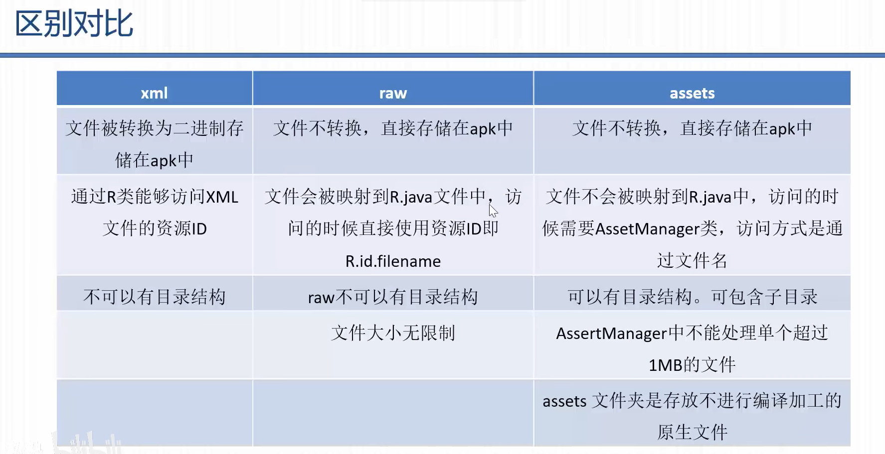


### 进程

- 前台进程
- 可见进程
- 服务进程
- 后台进程
- 空进程

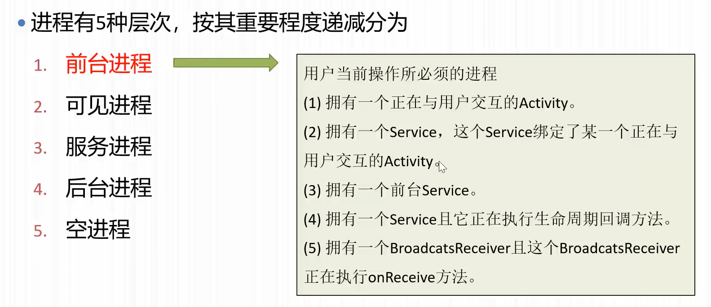

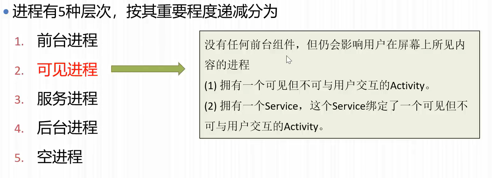

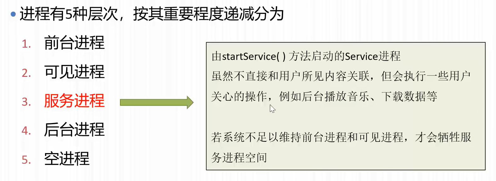

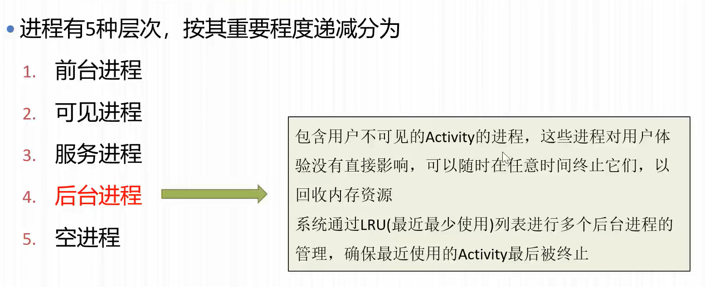


### SDK

```
安装目录:
	/.temp:
	/build-tools:
	/emulator:
	/extras:
	/fonts:
	/lecenses:
	/patcher:
	/platforms:
	/platform-tools:
	/skins:
	/sources:
	/system-iamges:
	/tools:
	.knownPackages:
```


### adb

```
adb:
	-d:
	-e:
	-s:
	connect:
	devices:
	get-state:
	install:
		-r:
	kill-server:
	logcat: (V|D|I|W|E|F|S)
		-c;
		-f:
		-v:
			color:
			time:
	pull:
	push:
	shell:
		am: ActivityManager
			start:
				-n:
		cat:
			
		cmd:
		date:
		dumpsys:
			activitys:
			battery:
			cpuinfo:
			meminfo:
			windown
		input:
			keyevent:
				3: Home
				4: 返回键
				24: 音量+
				25:	音量-+
			press:
			roll:
			swipe:
			tap:
			text:
		ls:
		monkey: 性能测试工具
			--bugreport:
			--ignore-crashes:
			-p: 指定包名
			--pct-touch:
			-s:
			--throttle:
			-v:
		pm: PackageManager:
			clear:
			list:
				packages:
					-3:
					-s:
		top:
			
	uninstall:
		-k:
```


#### emulator

```

```


## 核心内容

### Activity

```
AppCompatActivity:
	onCreate():
	onSaveInstanceState():
	---
	findViewById():
	finish(): 结束Activity
```


#### 生命周期


状态转换


2个Activity的生命周期


屏幕翻转会导致activity销毁重建


#### Intent

```
Intent:
	ACTION_SEND:
	EXTRA_SUBJECT:
	EXTRA_TEXT:
    FLAG_ACTIVITY_NEW_TASK:
    createChooser():
	---
	addCategory():
	putExtra():
	setAction():
	setData():
	setFlags():
	setType():
	
```


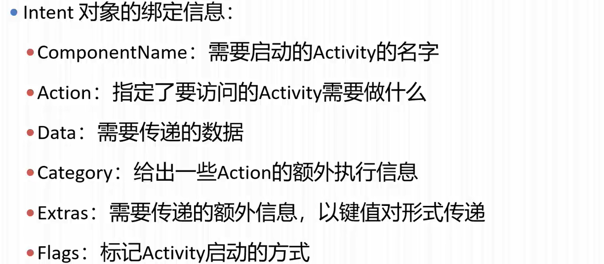


Intent解析

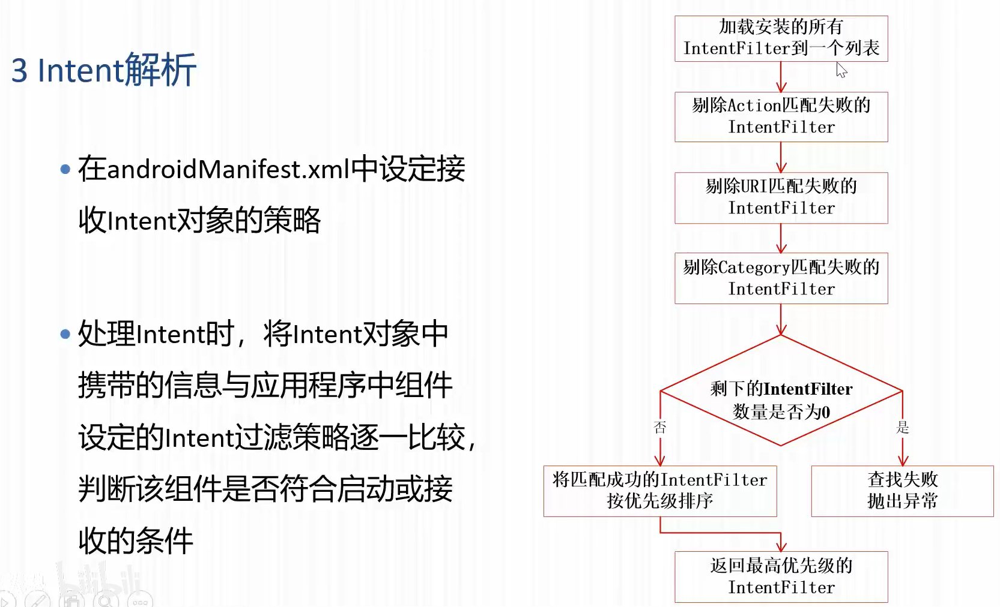


##### Bundle

```
Bundle:
	
```


##### ComponentName

```
ComponentName:
	
```


##### Action

```
Action:
	
```


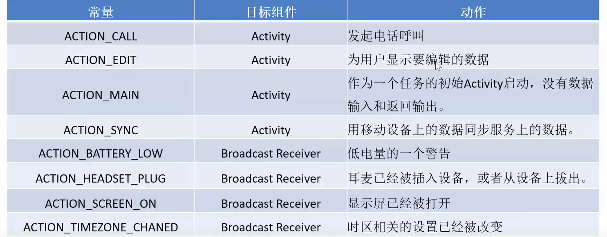


action常量

```
常量:
	android.media.action.IMAGE_CAPTURE:
```


##### Data

```
Data:
	
```


data uri

```
uri:
	content://contacts/people/
	geo:0,0
	http://xxx.com
	tel:17729014809
	tel://17729014809
```


##### Category

```
Category:
	
```


Category常量

```
常量:
	android.intent.category.APP_CALENDAR:
```


##### Extras


##### Flags


#### Fragment

```
Fragment:
	onCreate():
	---
	
```


##### 生命周期


静态调用、动态调用

FragmentManager、FragmentTrasaction、


### View

#### AppBarLayout


#### ConstraintLayout


#### DrawerLayout


#### FrameLayout


#### GridLayout


#### LinearLayout

```
LinearLayout:
	---
	addView():
```


#### RelativeLayout


#### TabLayout

```
TabLayout:
	
```


#### TableLayout


##### TableRow


#### Button

```
Button:
	drawableLeft:
	text:
	---
	setOnClickListener():
```


#### CalendarView


#### CheckBox

```
CheckBox:
	text:
	---
	isChecked():
```


#### EditText

```
EditText:
	editable:
	gravity:
	hint:
	imeOptions:
		actionDone:
		actionGo:
		actionSearch:
	inputType:
		numberSigned:
		phone:
		text:
		textPassword:
	lines:
	maxLength:
	numeric:
	password:
	textColorHint:
	---
	getText():
```


#### FloatingActionButton


#### HorizontalScrollView


#### ImageButton

```
ImageButton:
	src:
```


#### ImageView

```
ImageView:
	ScaleType:
		CENTER_CROP:
	scaleType:
		center: 中间
		fitCenter:
		fitStart:
		fitXY:
		matrix:
	src:
	---
	setImageResource():
	setScaleType:
```


#### ListView


#### MapView


#### ProgressBar

```
ProgressBar:
	max:
	min:
	progress:
	progressDrawable:
	style:
	---
	setProgress():
```


#### RadioButton

```
RadioButton:
	---
	getText():
	isChecked():
```


#### RadioGroup

```
RadioGroup:
	id:
	---
	setOnCheckedChangeListener():
```


#### RatingBar

```
RatingBar:
	---
	setOnRatinBarChangeListener():
```


#### RecyclerView

```
RecyclerView:
	
```


#### ScrollView

```
ScrollView:
	
```


#### SearchView

```
SearchView:
	
```


#### SeekBar

```
SeekBar:

	---
	setOnSeekBarChangeListener():
		onProgressChanged():
        onStartTrackingTouch():
        onStopTrackingTouch():
```


#### Spinner


#### SurfaceView

```
SurfaceView：
	
```


#### Switch

```
Switch:
	textOff:
	textOn:
	---
	setOnCheckedChangeListener():
```


#### TextView

```
TextView:
	autoLink:
		web:
	text:
	textSize:
	---
	setText():
	setTextColor():
```


#### TextureView

```
TextureView:
	
```


#### Toast

```
Toast:
    makeText():
	---
	getView():
	setDuration():
	setGravity():
	setView():
	show():
```


#### ToggleButton

```
ToggleButton:
	textOff:
	textOn:
	---
	isChecked():
```


#### VideoView

```
VideoView:
	
```


#### ViewPager

```
ViewPager:
	
```


#### WebView

```
WebView:
```


### Content

#### R

```
R:
	drawable:
	id:
	layout:		
	string:
```


#### Context

```
Context:
	---
	getResources():
	getSharedPreferences():
```


#### Localization

```
Localization:
	---
	
```


#### Broadcast

 系统广播

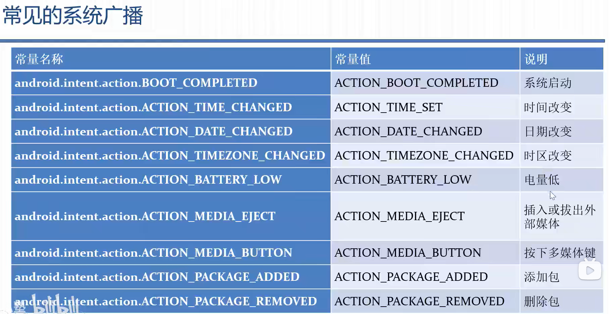


##### BroadcastReceiver

```
BroadcastReceiver:
	onReceive():
```


#### Notification

```
Notification:
	Builder:
		---
			build():
			setAutoCancel():
			setContentIntent():
			setContentText():
			setContentTitle():
			setLargeIcon():
			setSmallIcon():
			setStyle():
			setWhen():
```


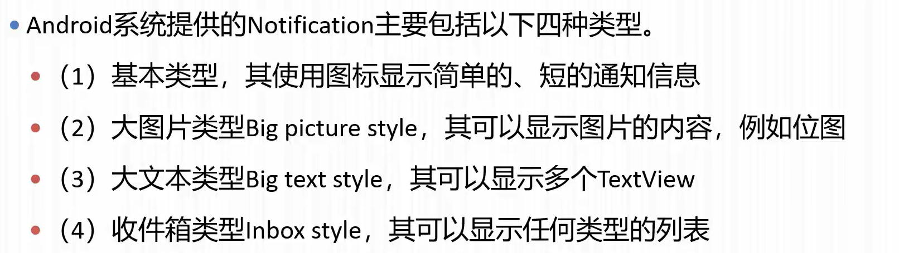


##### NotificationManager

```
NotificationManager:
	---
	createNotificationChannel():
	notify():
```


##### NotificationChannel

```
NotificationChannel:
	
```


#### Handler

```
Handler:
	handleMessage():
	---
	post():
	postAtTime():
	postDelayed():
	removeCallbacks():
	sendMessage():
```


常配合Thread使用


##### Message

```
Message:
	replyTo:
	what:
	---
	obtain():
```


##### Looper

```
Looper:
	
```


##### HandlerThread

```
HandlerThread:
	
```


#### ContentProvider

```
ContentProvider:
	onCreate():
	getType():
	query():
	insert():
	delete():
	update():
	---
```

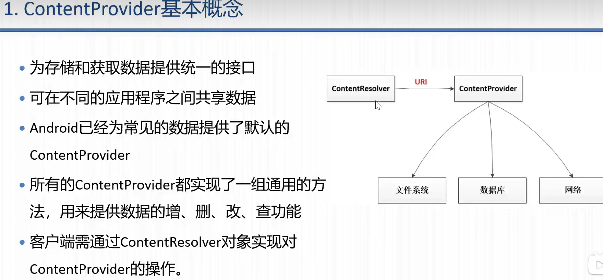

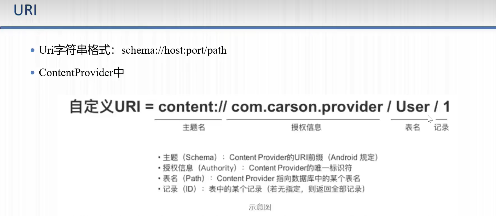


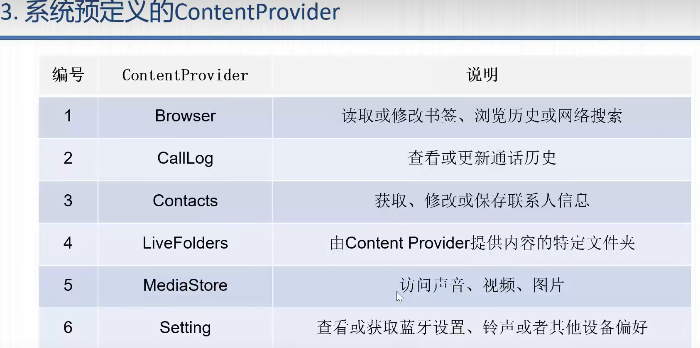


##### ContentResolve

```---
ContentResolve:
	---
	delete():
	insert():
	query():
```


##### ContentValues

```
ContentValues:
	
```


##### ContentUris

```
ContentUris:
	
```


##### UriMatcher

```
UriMatcher:
	
```


#### AsyncTask

```
AsyncTask:
	onPreExecute():
	doInBackground():
	onPostExecute():
	onProgressUpdate():
	---
	publishProgress():
```


##### Params	

##### Progress	

##### Result


#### Service

```
Service:
	onCreate():
	onStartCommand():
	onDestory():
	onBind():
	onUnbind():
	onRebind():
	---
```


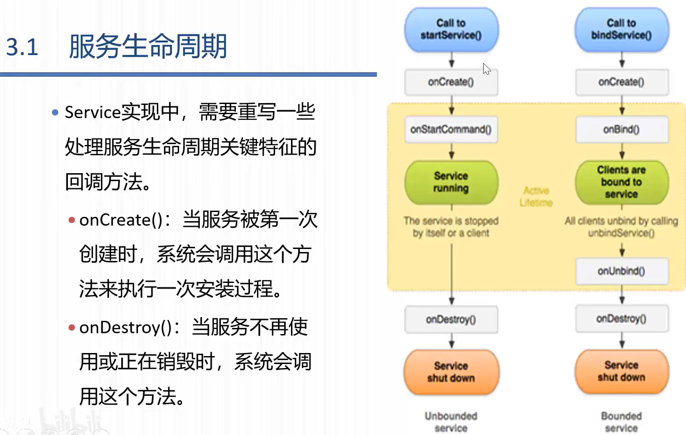

##### IntentService

```
IntentService:
	onHandleIntent():
	onDestory():
	---
```


##### ServiceConnection

```
ServiceConnection:
	onServiceConnected():
	onServiceDisconnected():
	---
	
```

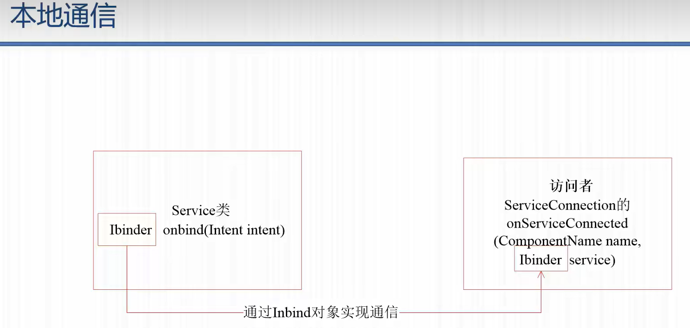


##### Binder

##### IBinder

```
IBinder:
	
```


##### Messenger

```
Messenger:
	---
	getBinder():
	send():
```


#### MediaPlayer

```
MediaPlayer:
	create():
	---
	isPlayint():
	pause():
	prepare():
	release():
	reset():
	setAudioStreamType():
	setDataSource():
	setDisplay():
	start():
```


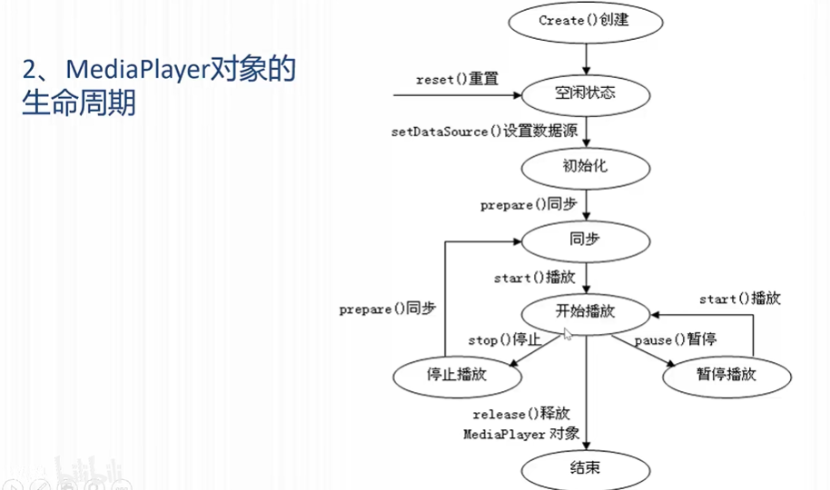


##### MediaRecorder

```
MediaRecorder:
	---
	prepare():
	release():
	reset():
	setAudioEncoder():
	setAudioSource():
	setOutputFilte():
	setOutputFormat():
	start():
	stop():
```


##### MediaController

```
MediaController:
	---
```


##### SurfaceView

```
SurfaceView:
	
	
	
SurfaceHolder:
	
```


##### VideoView

```
VideoView:
	---
	setMediaController():
	setVideoPath():
	start():
```


##### TextureView

```
TextureView:
	---
	setSurfaceTextureListener():
		onSurfaceTextureAvailable():
		onSurfaceTextureSizeChanged():
		onSUrfaceTextureDestroyed():
		onSurfaceTextureUpdated():
```


##### SurfaceTexture

```
SurfaceTexture:
	
```


##### ImageReader

```
ImageReader:
	---
	acquireNextImage():
	setOnImageAvailableListener():
	
```


##### Ringtone

```
Ringtone:
	
```


##### RingtoneManager

```
RingtoneManager:
	
```


##### AudioManager

```
AudioManager:
	
```


##### AudioAttributes

```
AudioAttributes:
	Builder():
	---
	
```


##### JetPlayer

```
JetPlayer:
	
```


##### SoundPool

```
SoundPool:
	
```


##### Camera2

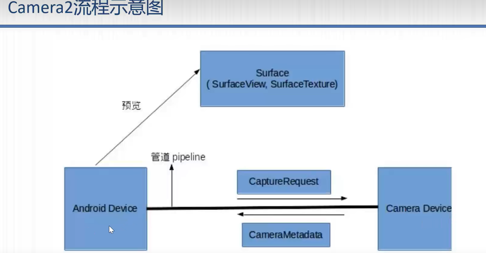

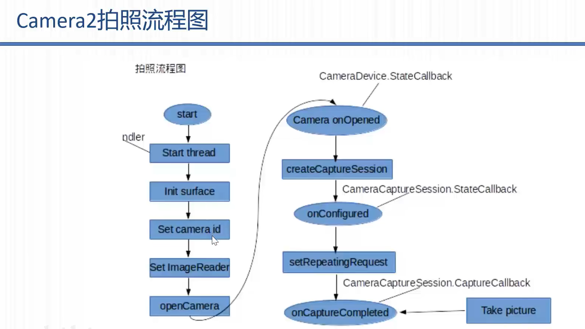


##### CameraManager

```
CameraManager:
	---
	getCameraIdList():
	getCameraCharacteristics():
	openCamera():
	
CameraDevice:
	StateCallback:
		onOpened():
		onDisconnected():
		onError():
    ---
    close():
    createCaptureRequest():
    createCaptureSession():
	
CaptureRequest:
	Builder:
	---
	
	
CaptureSession:
	StateCallback:
		onConfigured():
		onConfigureFailed():
    ---
    setRepeatingRequest():
	
Surface:
	---
	
CameraCharacteristics:
	
StreamConfigurationMap:
	---
	getOutputSizes():
	
Size:
	---
	
```


#### SharedPreferences

```
SharedPreferences:
	Editor:
		---
		putString():
		commit():
	---
	edit():
	getString():
```

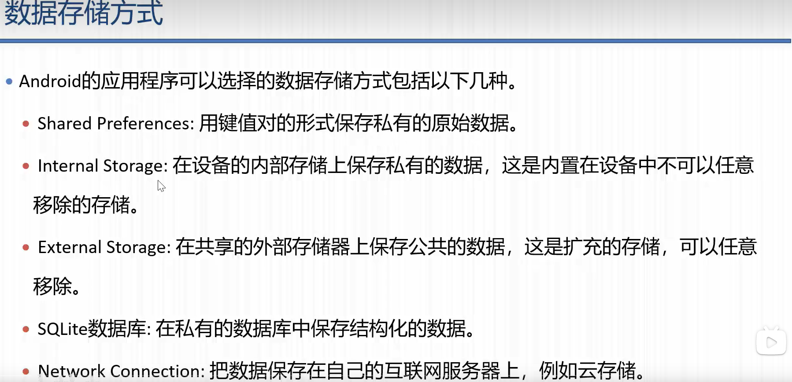

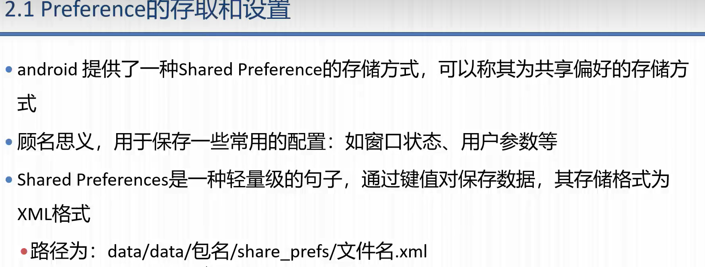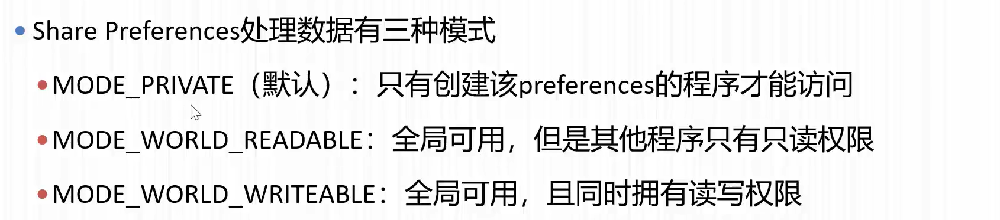


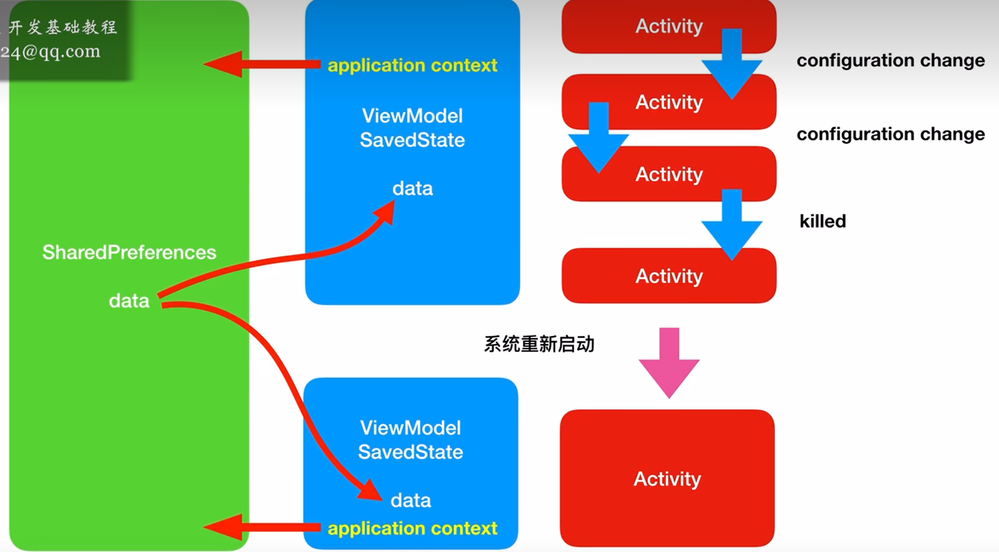


##### PreferenceScreen

```
PreferenceScreen:
	---
	getSharedPreferences():
	registerSharedPreferenceChangeListener():
	unregisterSharedPreferenceChangeListener()
```


`preferences.xml`

```
<PreferenceScreen>
	<PreferenceCategory
		key:
		title:
		app:summary:
	>
		<CheckBoxPreference
			key:
            title:
            summary:
		>
		<EditTextPreference
			key:
			title:
			summary:
		>
		<ListPreference
			key:
			title:
			summary:
			entries:
			entryValues:
			dependency:
		>
```

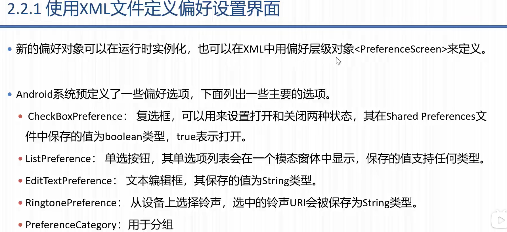


**PreferenceFragmentCompat**

```
PreferenceFragmentCompat:
	onCreatePreferences():
	---
	setPreferencesFromResource():
	findPreference(): 
	
OnHaredPreferenceChangeListener:
	onSharedPreferenceChanged():
	---
```


##### Preference

```
Preference:
	---
	setSummary():
```


#### 内部存储器

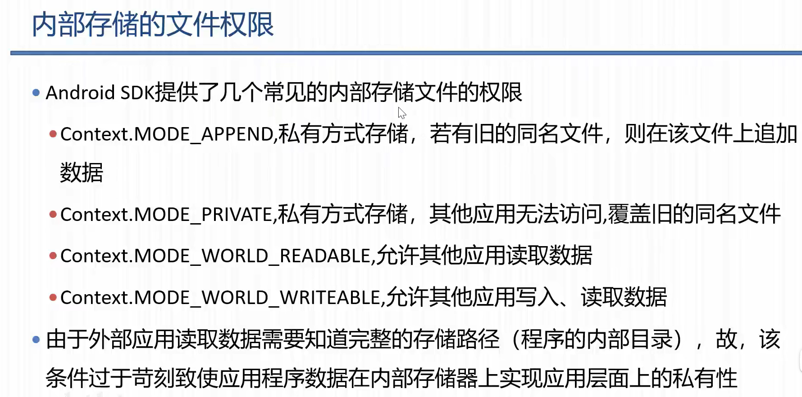


#### 外部存储

```
:
	DIRECTORY_ALARMS
    DIRECTORY_AUDIOBOOKS
    DIRECTORY_DCIM
    DIRECTORY_DOCUMENTS
    DIRECTORY_DOWNLOADS
    DIRECTORY_MOVIES
    DIRECTORY_MUSIC
    DIRECTORY_NOTIFICATIONS
    DIRECTORY_PICTURES
    DIRECTORY_PODCASTS
    DIRECTORY_RECORDINGS
    DIRECTORY_RINGTONES
    DIRECTORY_SCREENSHOTS
```


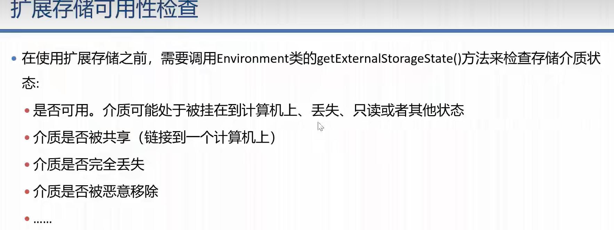


#### SQLite

##### SQLiteOpenHelper

```
SQLiteOpenHelper:
	OnCreate():
	OnUpgrade():
	---
	getWritableDatabase():
```


##### SQLiteDatabase

```
SQLiteDatabase:
	---
	delete():
	execSQL():
	isReadOnly():
	rawQuery():
	update():
```


##### Cursor

```
Cursor:
	---
	getColumnIndex():
	getString():
	isAfterLast():
	moveToFirst():
	moveToNext():
```


##### ContentValues

```
ContentValues:
	
```


#### Canvas

```
Canvas:
	---
	drawCircle():
	drawColor():
	drawPaht():
	drawRect():
```


##### Path

```
Path:
	---
	close():
	lineTo():
	moveTo():
```


##### Paint

```
Paint:
	---
	setColor():
	setStrokeWidth()):
	setStyle():
	setAntiAlias():
```

​	

##### AttributeSet

```
AttributeSet:
	
```


 


### Window

#### Menu

`menu.xml`

```
<menu>
	<group
		checkableBehavior:
	>
		<item>
	<item
		id:
		title:
		icon:
		orderInCategory:
		app:actionViewClass:
		app:showAsAction:
			never:
			ifRoom:
			withText:
			collapseActionView:
		app:actionProviderClass:
	>
		<menu> // 嵌套menu
```

##### MenuItem

```
MenuItem:
	getActionView():
	setOnActionExpandListener():
		onMenuItemActionExpand():
		onMenuItemActionCollapse():
```


#### PopupMenu

```
PopupMenu:
	inflate();
	setOnMenuItemClickListener():
	show():
```


#### ContextMenu

```
ContextMenu:
	add():
```


##### ContextMenuInfo	


#### Toolbar


#### ActionMode

```
ActionMode:
	Callback:
		onActionItemClicked():
		onCreateActionMode:
		onDestroyActionMode():
		onPrepareActionMode():
```


#### ActionView

```
ActionView:
```


#### ActionProvider

```
ActionProvider:
	onCreateActionView():
	onPerformDefaultAction():
	---
	
	
ShareActionProvider:
	---
	setShareIntent():
```


#### TabLayout

```
TabLayout:
	---
	setupWithViewPager():
```


##### SectionsPagerAdapter

```
SectionsPagerAdapter:
```


##### ViewPager

```
ViewPager:
	---
	setAdapter():
```


#### BottomNavigationView

```
BottomNavigationView:
	
```


##### NavigationView

```
NavigationView:
	app:headerLayout:
	app:menu:
```


##### Navigation

```
Navigation:
	
```


##### NavController

```
NavController:
```


##### NavigationUI

```
NavigationUI:
```


##### AppBarConfiguration

```
AppBarConfiguration:
```


### Resource

#### Android内置资源

```
@android:id:
	background:
	progress:
	
@android:style:
	Widget:
		ProgressBar:
			Horizontal:
```


#### Animation

##### \<set>

```
<set>
	<rotate
		fromDegrees:
		toDegrees:
		pivotx:
		pivotY:
		duration:
	>
	<scale
		fromXScale:
		toXScale:
		fromYScale:
		toYScale:
		pivotX:
		pivotY:
		duration:
	>
	<translate
		fromXDelta:
		toXDelta:
		duration:
	>
```


#### \<layer-list>

```
<layer-list>
	<item
		left:
		top:
	>
		<bitmap
			src:
			gravity:
		>
		<scale
			scaleWidth:
			drawable:
		>
		<shape>
			<solid>
			<gradient
				angle:
				startColor:
				endColor:
			>
```


#### \<navigation>

```
<navigation>
	<fragment
		
	>
```


#### \<resources>

```
<resources>
	<dimen
		name: "属性名"
	>
	<string>
	<string-array
		name:
	>
		<item
			name:
		>
```


#### \<selector>

```
<selector>
	<item
		state_focused:
		state_pressed:
		color:
		drawable:
	>
```


#### \<vector>

```
<vector

>
	<path
		
	>
```


## JetPack


Google推出的一套系列组件集


### AppCompat


### 数据绑定

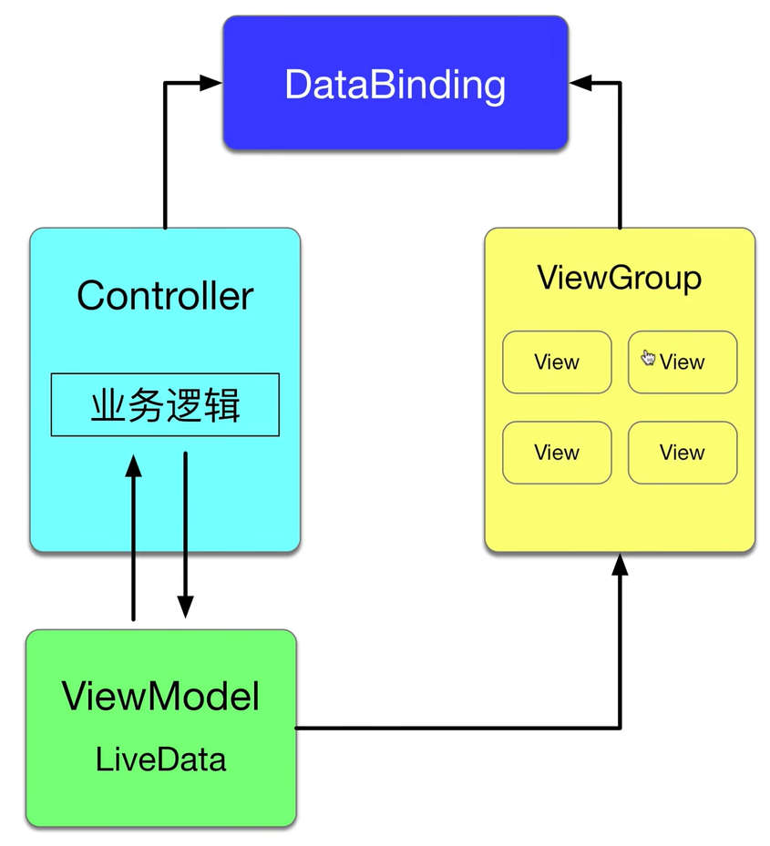


#### DataBinding

```
<layout>
	<data>
		<variable
			name: _vm（通过@{_vm.xxx}使用VM属性）
			type: VM全类名
		>
		
	
    
		
		
---
ActivityMainBinding: （自动生成）
	
```


Activety中实现Binding，并注入ViewModel（xml中声明的ViewModel）

```
class MainActivity:
	ActivityMainBinding binding
	MainViewModel mainViewModel
	
	onCreate()
		// 绑定vm数据
		binding = DataBindingUtil.setContentView(this, R.layout.activity_main)
		/*
			旧版本：
			mainViewModel = ViewModelProviders.of(this).get(MainViewModel.class)
		*/
		mainViewModel = new ViewModelProvider(this, new ViewModelProvider.AndroidViewModelFactory(getApplication()).get(MainViewModel.class))
		binding.setVm(mainViewModel)
		// 建立感应
		binding.setLifecycleowner(this)
```


#### BindingAdapter

@{}的代码扩展使用，自动被扫描进value对应的属性中

```
class XxxAdapter:
	@BindingAdapter(value={"imageUrl"})
	void loadUlr(view, url)
		view|view.getContext()
```


### Lifecycles

```
Lifecycle:
	---
	addObserver():

LifecycleOwner:
	---

LifecycleObserver:
	onCreate():
	onStart():
	onResume():
	onPause():
	onStop():
	onDestroy():
	---
```


观察Activity、Fragment生命周期的变化，执行观察者的代码、销毁观察者对象


### ViewModel

```
ViewModel:
	SavedStateHandle:
		contains():
		getLiveData():
		set():
	---

ViewModelStore:


ViewModelStoreOwner:


AndroidViewModel:
	---
	
```

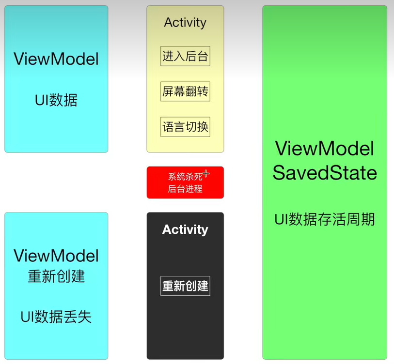


存储LiveData数据，和修改LiveData的方法，ViewModelStore

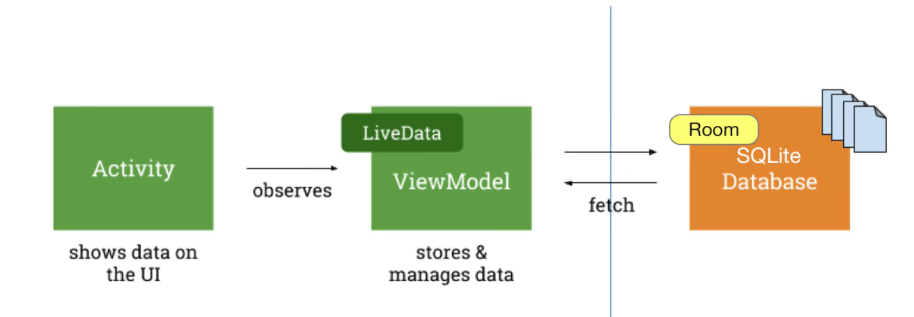

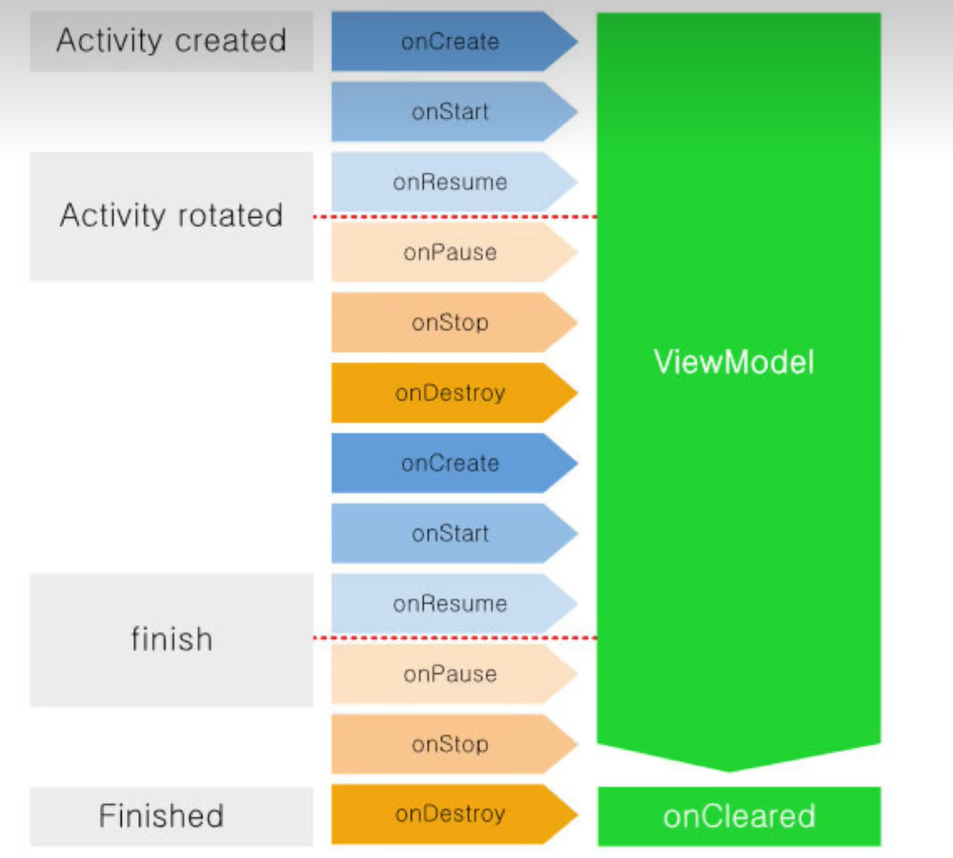


### LiveData

```
LiveData:
	---
	observe():
		Observer:
			onchanged():
		---
	
MutableLiveData:
	---
	postValue():
	setValue():
```


感应变化的数据，值变化能触发界面刷新


### Room

```
Room:
	databaseBuilder():
	---


注解:
	@ColumnInfo:
		name:
	@Entiry:
	@PrimaryKey:
		autoGenerate:
	---
	@Dao:
	@Delete:
	@Insert:
	@Query():
	@Update:
	---
	@Database:
		entities:
		version:
		exportSchema:
```


SQLite数据库抽象


### Paging


### Navigation

```
Navigation:
	createNavigateOnClickListener():
	findNavController():
```


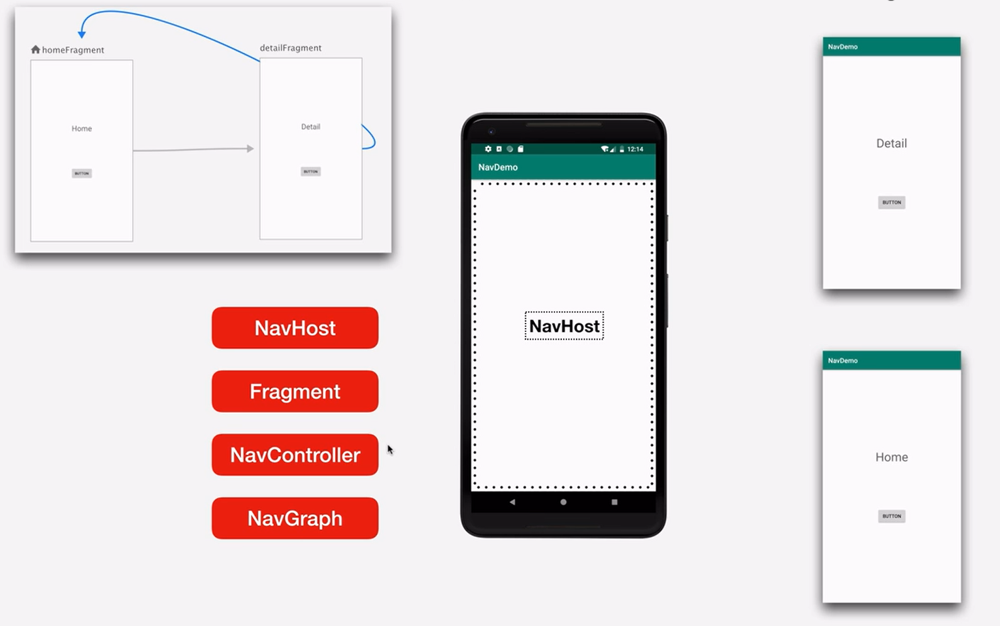


Navigation常与fragment连用

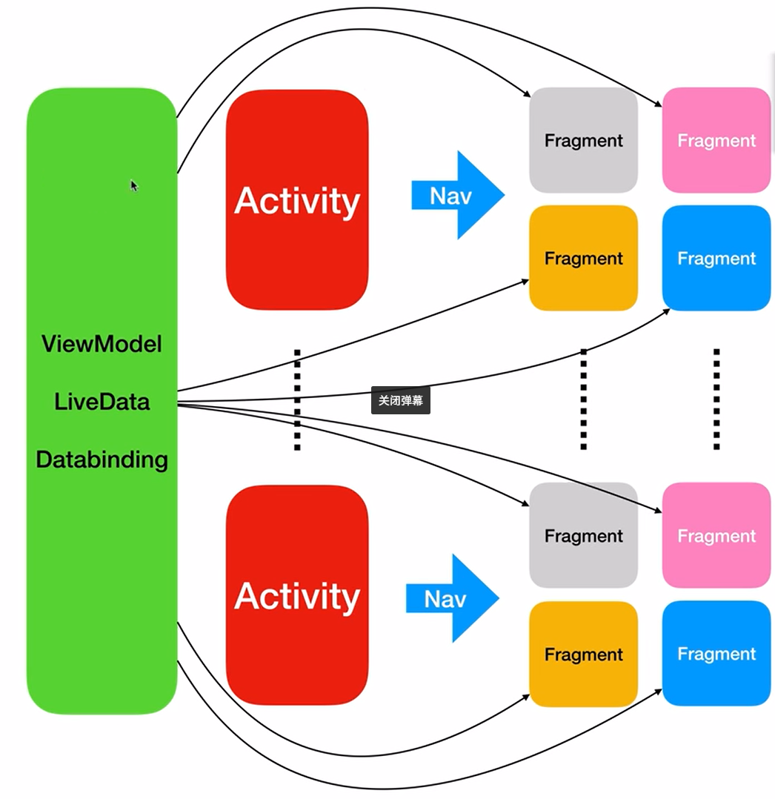


#### navigation

##### nav_graph.xml

```

```


##### GRAPH


##### NavHostFragment

```
NavHostFragment:
	
```


NavHostFragment为Navigation入口容器

`NavHostFrament(activity_main.xml中的fragment)`->`nav_graph.xml(定义fragment跳转关系)`->`Fragment视图定义`->`xxxfragment.xml`


#### NavController

```
NavController:
	---
	navigate():
	navigateUp():
```

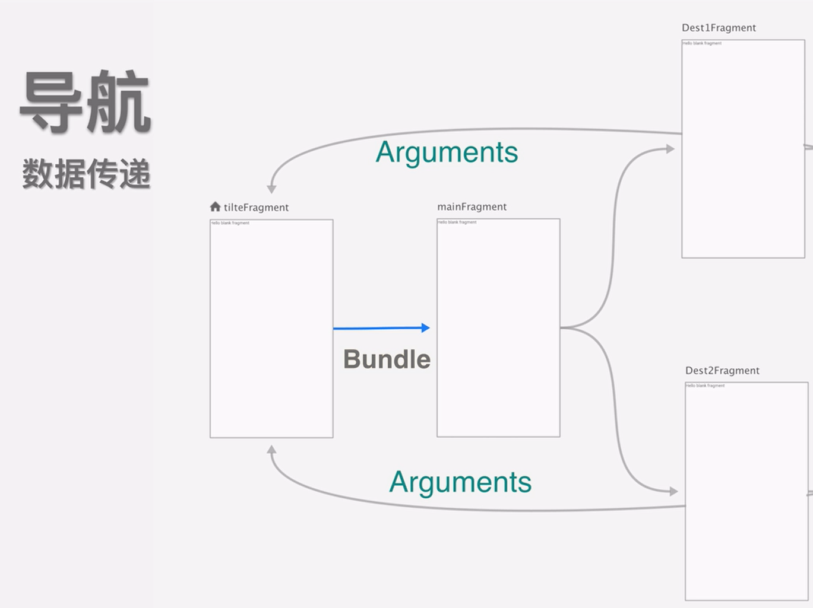


#### NavigationUI

```
NavigationUI:
	setupActionBarWithNavController():
		onSupportNavigateUp():
	---
```


### WorkManager


## JNI

```
System.loadLibrary(): Java加载库
（）
native xxx(): c++函数声明


--- .so库文件生成
#include <jni.h>

extern "C" JNIEXPORT jstring JNICALL
Java_包名_activity名_xxx(JNIEnv* env, jobject) {
	return env->NewStringUTF();
}
```


## API

```
android:
	R:
		attr:
			state_enabled:
			state_focused:
			state_pressed:
		drawable:
        id:
        layout:
		
	util:
		DisplayMetrics:
			heightPixels:
			widthPixels:
	view:
		View:
			findViewById():
	widget:
		Button:
		TextView:

androidx:
	constraintlayout:
		widget:
			ConstraintLayout:
	coordinatorlayout:
		widget:
			Coordinatorlayout:	
    fragment:
    	app:
    		Fragment:
	lifecycle:
		AndroidViewModel:
		LiveData:
			observe():
			postValue():
		MutableLiveData<T>:
		ViewModel
	viewpager:
		widget:
			ViewPager:


AppCompatActivity:
	bindService():
	checkSelfPermission():
	findViewById():
	finish():
	getApplicationContext():
	getExternalCacheDir():
	getExternalFilesDir():
	getExternalCacheDirs():
	getExternalFileDirs():
	getExternalMediaDirs():
	getIntent():
	getLayoutInflater():
	getMenuInflater():
	getPreferenceManager():
	getPreferenceScreen():
	getResources():
	getSharedPreferences():
	getSupportFragmentManager():
	getSystemService():
	onActivityResult():
	onAttachFragment():
	onContextItemSelected():
	onCreate():
	onCreateContextMenu():
	onCreateOptionsMenu():
	onOptionsItemSelected():
	onRequestPermissionsResult():
	onSupportNavigateUp():
	openFileInput():
	openFileOutput():
	registerForContextMenu():
	registerReceiver():
	requestPermissions():
	sendBroadcast():
	setContentView():
	setResult():
	setSupportActionBar():
	startActionMode():
	startActivity():
	startActivityForResult():
	startService():
	unbindService():
	unregisterReceiver():
Bundle:
Button:
	id:
	text:
ComponentName:
Drawable:
EditText:
	hint:
	getText():
EventActivity:
	this:
Fragment:
	getActivity():
	onActivityCreated():
	onCreateView():
FragmentManager:
	---
	add():
	beginTransaction():
	commit():
	commitNow():
	findFragmentById():
	remove():
FrameLayout:
GridLayout:
Handler:
	postDelayed():
ImageView:
	src:
	---
	getDrawable():
	setImageDrawable():
	setOnLongClickListener():
Intent:
	---
	setAction():
	setClassName():
	setComponent():
LayoutInflater:
	inflate():
LinearLayout:
	layout_gravity:
	layout_height:
		wrap_content:
	layout_width:
		match_parent:
	orientation:
Log:
	d():
	e():
	i():
	w():
RelativeLayout:
Space:
Spannable:
StateListDrawable:
StyleSpan:
TableLayout:
TextView:
	
View:
	onDraw():
	---
	invalidate():
ViewGroup:
```


