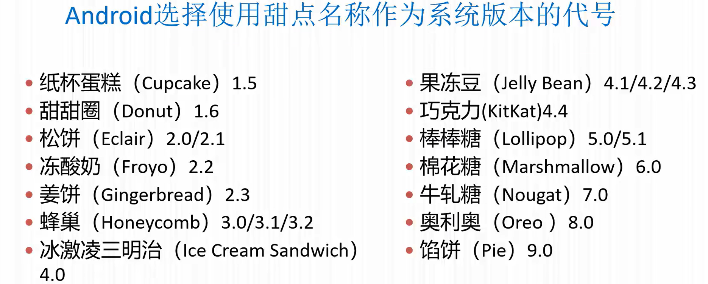
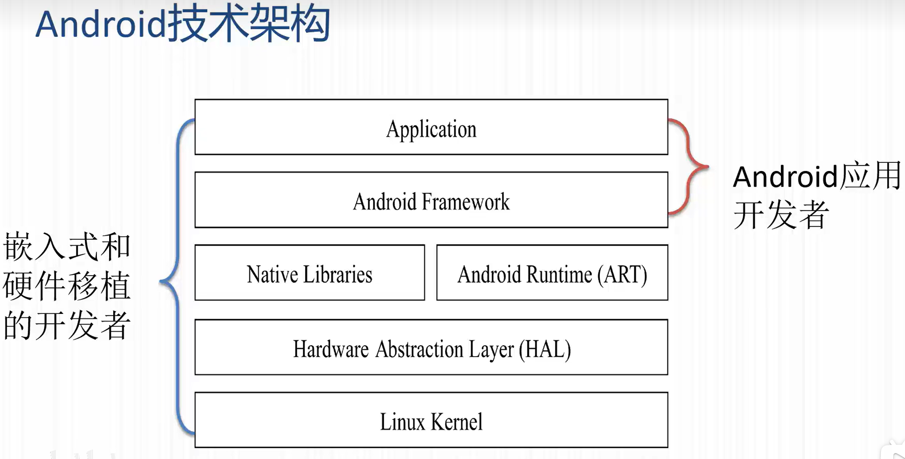
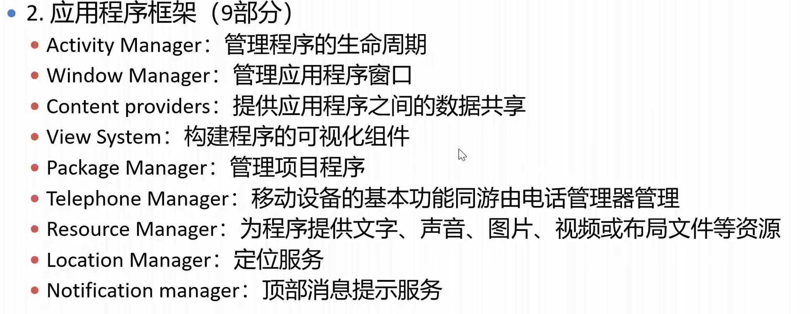
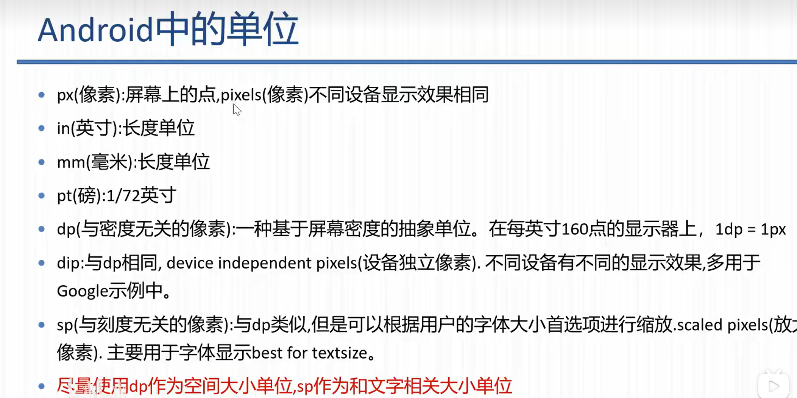
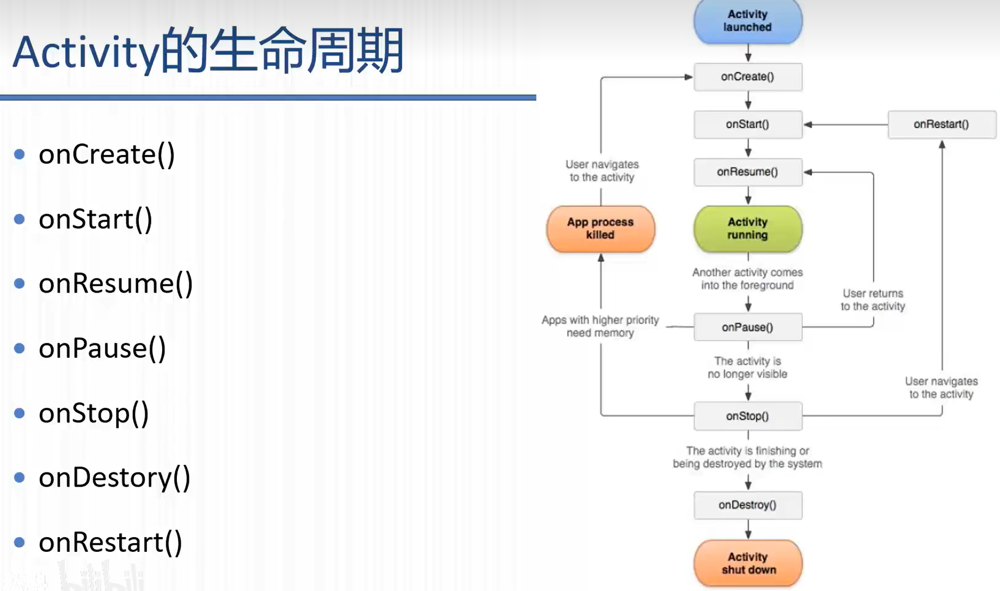
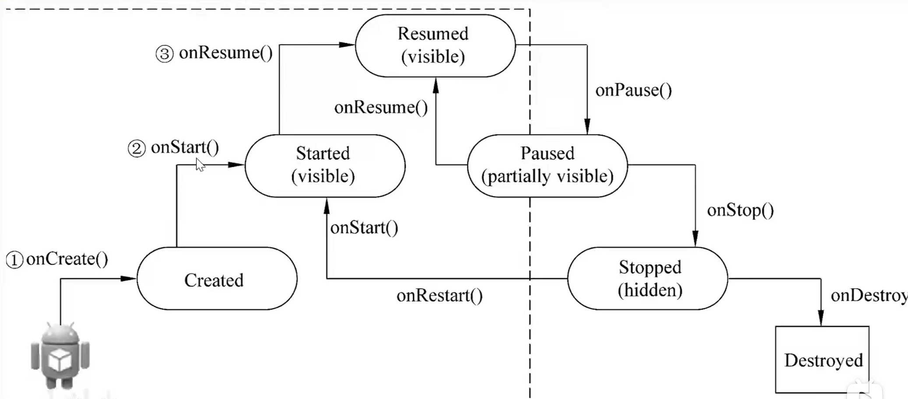
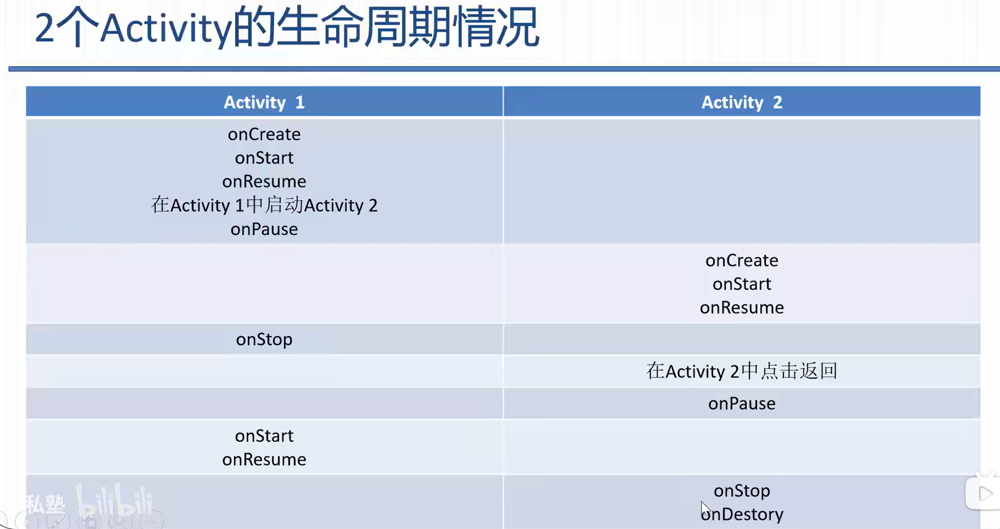
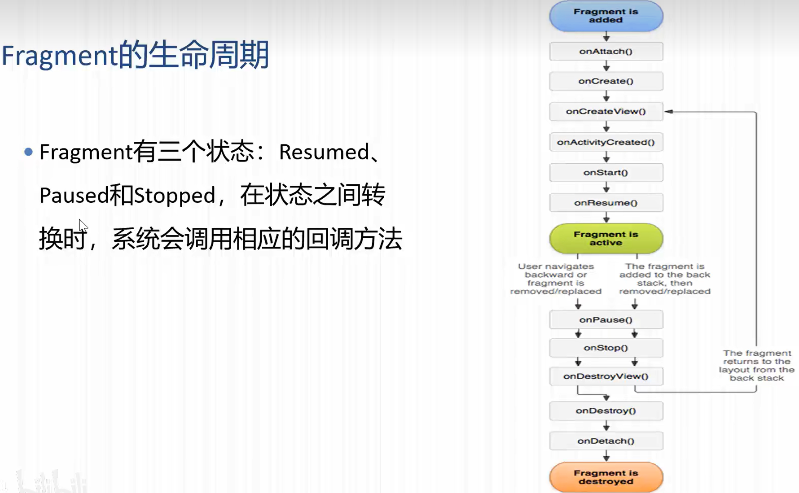
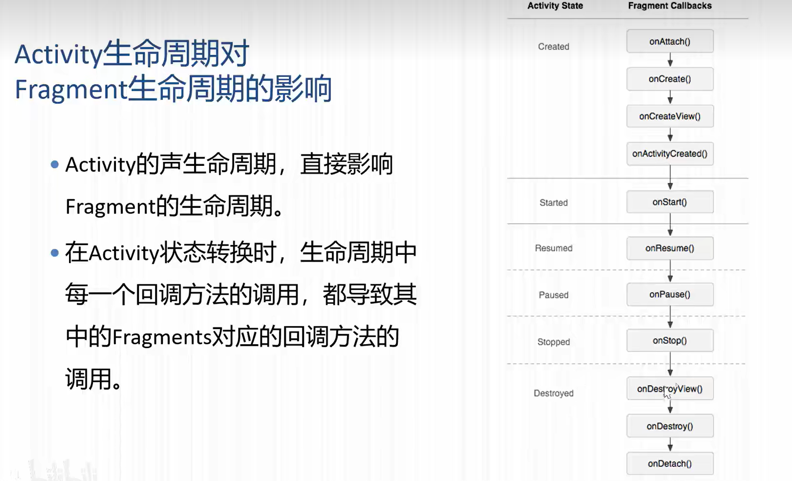

# Android基础

> Author: Sylvie233
>
> Date: 2023/5/8
>
> Point: 安卓基础 P38|Jetpack P10


[TOC]

## 基础介绍

Android版本




**Android技术架构**






Android单位




### **目录结构**

```
:
	/build:
		/generated:
		/intermediates:
		/outputs:
		/tmp:
	/libs:
	/src:
		/androidTest:
		/main:
			/java:
			/res:
				/animator:
				/anim:
				/color:
				/drawable: (xxxhdpi|xxhdpi|xhdpi|hdpi|mdpi)
                /layout:
                	activity_main.xml:
                /menu:
                /mipmap: (xxxhdpi|xxhdpi|xhdpi|hdpi|mdpi)
                	/ic_launcher:
                /raw:
                /values:
                    colors.xml:
                    strings.xml:
                    styles.xml: 样式定义文件
                /xml:
			AndroidManifest.xml:
		/test:
	build.gradle:
```


`AndroidManifest.xml`

```
<manifest>
	<supports-screens>
	<applicatioin
		allowBackup:
		icon:
		label:
		roundIcon:
		supportsRtl:
		theme: @style/xxx应用样式
	>
		<activity
			name
		>
			<intent-filter>
				<action
					name:
				>
				<category
					name:
						LAUNCH:
						DEFAULT:
				>
```


`layout/activity_main.xml`

```
<Root>
	<include
		layout: 复用layout布局
	>
	
	<fragment
		id:
		name: 全类名
	>
```


`values/colors.xml`

```
<resources>
	<color
		name:
	>
```


`values/strings.xml`

```
<resources>
	<string
		name:
	>
```


`values/styles.xml`

```
<resources>
	<style
		name:
		parent:
	>
		<item
			name:
		>
			@color/xxx
			@style/xxx
```


## 核心内容

### Activity

#### 生命周期




状态转换




2个Activity的生命周期




#### Intent


#### Fragment

##### 生命周期






静态调用、动态调用

FragmentManager、FragmentTrasaction、


### View

#### ConstraintLayout


#### FrameLayout


#### GridLayout


#### LinearLayout

```
LinearLayout:
	---
	addView():
```


#### RelativeLayout


#### TableLayout


##### TableRow


#### Button

```
Button:
	drawableLeft:
	text:
	---
	setOnClickListener():
```


#### CalendarView


#### CheckBox

```
CheckBox:
	text:
	---
	isChecked():
```


#### EditText

```
EditText:
	editable:
	gravity:
	hint:
	imeOptions:
		actionDone:
		actionGo:
		actionSearch:
	inputType:
		numberSigned:
		phone:
		text:
		textPassword:
	lines:
	maxLength:
	numeric:
	password:
	textColorHint:
	---
	getText():
```


#### HorizontalScrollView


#### ImageButton

```
ImageButton:
	src:
```


#### ImageView

```
ImageView:
	ScaleType:
		CENTER_CROP:
	scaleType:
		center: 中间
		fitCenter:
		fitStart:
		fitXY:
		matrix:
	src:
	---
	setImageResource():
	setScaleType:
```


#### ListView


#### MapView


#### ProgressBar

```
ProgressBar:
	max:
	min:
	progress:
	progressDrawable:
	style:
	---
	setProgress():
```


#### RadioButton

```
RadioButton:
	---
	getText():
	isChecked():
```


#### RadioGroup

```
RadioGroup:
	id:
	---
	setOnCheckedChangeListener():
```


#### Spinner


#### Switch

```
Switch:
	textOff:
	textOn:
	---
```


#### TextView

```
TextView:
	autoLink:
		web:
	text:
	textSize:
	---
	setText():
	setTextColor():
```


#### Toast

```
Toast:
    makeText():
	---
	getView():
	setDuration():
	setGravity():
	setView():
	show():
```


#### ToggleButton

```
ToggleButton:
	textOff:
	textOn:
	---
	isChecked():
```


#### WebView


### Content


### Window


### Resource

#### Android内置资源

```
@android:id:
	background:
	progress:
	
@android:style:
	Widget:
		ProgressBar:
			Horizontal:
```


#### \<layer-list>

```
<layer-list>
	<item
		left:
		top:
	>
		<bitmap
			src:
			gravity:
		>
		<scale
			scaleWidth:
			drawable:
		>
		<shape>
			<solid>
			<gradient
				angle:
				startColor:
				endColor:
			>
```


#### \<resources>

```
<resources>
	<string>
```


#### \<selector>

```
<selector>
	<item
		state_focused:
		state_pressed:
		color:
		drawable:
	>
```


### JetPack


Google推出的一套系列组件集


#### AppCompat


#### 数据绑定

##### DataBinding

```
<layout>
	<data>
		<variable
			name: _vm（通过@{_vm.xxx}使用VM属性）
			type: VM全类名
		>
```


Activety中实现Binding，并注入ViewModel（xml中声明的ViewModel）

```
class MainActivity:
	ActivityMainBinding binding
	MainViewModel mainViewModel
	
	onCreate()
		// 绑定vm数据
		binding = DataBindingUtil.setContentView(this, R.layout.activity_main)
		/*
			旧版本：
			mainViewModel = ViewModelProviders.of(this).get(MainViewModel.class)
		*/
		mainViewModel = new ViewModelProvider(this, new ViewModelProvider.AndroidViewModelFactory(getApplication()).get(MainViewModel.class))
		binding.setVm(mainViewModel)
		// 建立感应
		binding.setLifecycleowner(this)
```


##### BindingAdapter

@{}的代码扩展使用，自动被扫描进value对应的属性中

```
class XxxAdapter:
	@BindingAdapter(value={"imageUrl"})
	void loadUlr(view, url)
		view|view.getContext()
```


#### Lifecycles

观察Activity、Fragment生命周期的变化，执行观察者的代码、销毁观察者对象


#### ViewModel

存储LiveData数据，和修改LiveData的方法，ViewModelStore


#### LiveData

感应变化的数据，值变化能触发界面刷新


#### Room


#### Paging


#### Navigation


#### WorkManager


## API

```
android:
	R:
		attr:
			state_enabled:
			state_focused:
			state_pressed:
		drawable:
        id:
        layout:
		
	util:
		DisplayMetrics:
			heightPixels:
			widthPixels:
	view:
		View:
			findViewById():
	widget:
		Button:
		TextView:

androidx:
	constraintlayout:
		widget:
			ConstraintLayout:
    fragment:
    	app:
    		Fragment:
	lifecycle:
		AndroidViewModel:
		LiveData:
			observe():
			postValue():
		MutableLiveData<T>:
		ViewModel


AppCompatActivity:
	findViewById():
	getApplicationContext():
	getLayoutInflater():
	getResources():
	onAttachFragment():
	onCreate():
	setContentView():
	startActivity():
Bundle:
Button:
	id:
	text:
ComponentName:
Drawable:
EditText:
	hint:
	getText():
EventActivity:
	this:
Fragment:
	getActivity():
	onActivityCreated():
	onCreateView():
FragmentManager:
	---
	add():
	beginTransaction():
	commit():
	commitNow():
	findFragmentById():
	remove():
FrameLayout:
GridLayout:
Handler:
	postDelayed():
ImageView:
	src:
	---
	getDrawable():
	setImageDrawable():
Intent:
	---
	setAction():
	setClassName():
	setComponent():
LayoutInflater:
	inflate():
LinearLayout:
	layout_gravity:
	layout_height:
		wrap_content:
	layout_width:
		match_parent:
	orientation:
Log:
	d():
	e():
	i():
	w():
RelativeLayout:
Space:
Spannable:
StateListDrawable:
StyleSpan:
TableLayout:
TextView:
	
View:
ViewGroup:
```


