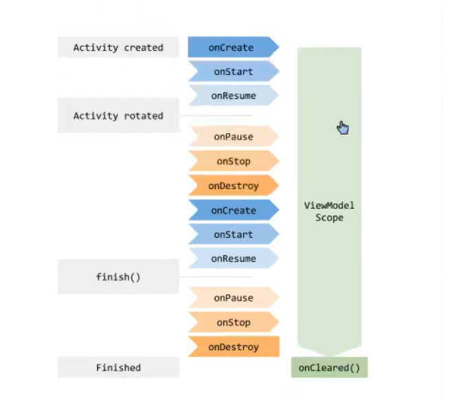
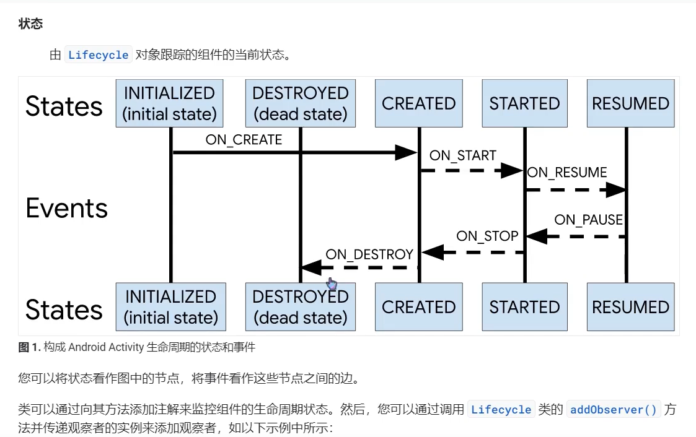

# JetPack

> Author: Sylvie233
>
> Date: 23/6/1
>
> Point:
> 	Kotlin+Jetpack实战开发在线教育App：P30
> 	android 论坛项目开发实战：P12


## 基础知识


MVVM架构：


MVP架构：


### 协程


suspend挂起函数，只能在协程中运行


#### Dispatchers:

##### Default
##### IO
##### Main


#### CoroutineScope:
需要传入上下文才可使用

##### async
和js中的async效果一样，可通过await获取返回值


##### launch


#### GlobalScope:
应用级生命周期
##### launch


#### lifecycleScope
##### launch


#### viewModelScope
##### launch


#### flow
类似迭代器

##### emit
发送当前阶段信号

##### collect
收集当前阶段信号，常与when连用


#### runBlocking


#### runOnUiThread


#### runCatching


#### select
多个协程加when操作


#### suspendCancellableCoroutine
```
continuation:
	isCancelled:
	invokeOnCancellation():
	resume():
	resumeWithException():
```


#### withContext
切换上下文


#### withTimeout


### gradle


- settings.gradle: 项目设置
- gradle.properties: 项目属性
- local.properties: 安卓SDK配置
- gradle-wrapper.properties: gradle的Wrapper属性
- build.gradle：具体项目配置

#### build.gradle

```
:
	apply: 应用插件
	plugins:
		id:
		version:
		apply:
	android: 安卓配置
		namespace:
		compileSdk:
		defaultConfig:
			applicationId:
			minSdk:
			targetSdk:
			versionCode:
			versionName:
			testInstrumentationRunner:
		buildTypes:
			release:
				minifyEnabled:
				proguardFiles:
		compileOptions:
			sourceCompatibility:
			targetCompatibility:
		kotlinOptions:
			jvmTarget:
	dependencies: 项目依赖
		implementation:
		testImplementation:
		androidTestImplementation:
		kapt:
	pluginManagement:
		repositories:
			maven():
	dependencyResolutionManagement: 集中管理依赖项
		repositories:
	include:
	---
常用变量:
	rootProject:
	singleModule:
```


## JetPack
API
```yaml
androidx:
	lifecycle:
		AndroidViewModel:
		LiveData:
	recyclerview:
		widget:
			ItemTouchHelper:
	room:
		Dao:
		Insert:
		Query:
```

![[Pasted image 20240212173009.png]]

Activity.xml(\<data>) -> DataBinding(BindingAdapter)(Databinding中可传入ViewModel)
Activity -> ViewBinding
Activity -> ViewModel -> LiveData(数据变化回调函数监听)
Activity/Fragment -> Lifecycle（生命周期函数监听）


Adapter -> ViewHolder(每个item的页面) -> XXXBinding类（如果用了数据绑定）


### AppCompatActivity

```
AppCompatActivity:
	layoutInflater:
	lifecycle:
	onCreate():
	---
	setContentView():
```


### ViewModel

```
ViewModel:
	onCleared():
	---
	clear():
```

属于lifecycle组件库的一部分


#### 生命周期




#### AndroidViewModel
绑定application


#### ViewModelProvider


##### ViewModelStore
##### ViewModelProviderFactory
##### ViewModelLazy


### LiveData
可监听数据变化，能感受Activity和Fragment的生命周期变化，可与数据库绑定
```

MutableLiveData:
	---
	value:
	map(): 数据转换
	observe():
	postValue():
	setValue():
```

#### MediatorLiveData
多个LiveData合并


#### SwitchMap
多数据源的切换和控制


### DataBinding

```
ViewDataBinding:
	inflate():
	---
	
DataBindingUtil:
	bind():
	setContentView():
	---
```


为layout生成`XXXbinding`类，编译自动生成databinding.XXXBindingImpl实现类


BindingAdapter实现xml中的方法


DataBinding与ViewModel是两个不同层面的东西，ViewModel是与持久层（数据库）连接的的东西，DataBinding是与UI连接的东西


#### DataBindingUtil
获取binding实例

##### XXXBinding
自动生成的ActivityBinding类

##### ObservableField
可观察的字段绑定类型，类似集成了LiveData，感知数据变化，刷新UI

##### BaseObservable
可观察的字段类，类似集成了LiveData
```
BaseObservable:
	@Bindable:
	---	
	notifyPropertyChanged():
```


#### ViewBinding
替代findViewById()方法
```
ActivityMainBinding:
	xxx:
	root:
	bind()
	inflate():
	---
```


自动为每个XML文件生成`XXXBinding`类,简化了为每个控件`findViewById()`来获取

##### LayoutInflater


#### layout

```
<layout>
	<data>
		<import
			type:
		>
		<variable
			name:
			type:
		>
		
使用：
	@{xxx变量}
	@={xxx}: 双向数据绑定
```


双向数据绑定


#### BindingAdapter

#### BindingConversion

#### InverseBindingAdapter

#### BindingMethods


### Lifecycle
管理Activity和Fragment的生命周期，生命周期观察者(监听器)，将生命周期钩子函数单独抽取到一个类中(配合注解使用)，观察者模式，
```
Lifecycle:
	currentState:
		isAtLeast():
	---
	addObserver():

LifecycleOwner:

LifecycleObserver:
	@OnLifecycleEvent:
		
```





Lifecycle关联ViewModel和LiveData


#### LifecycleOwner


#### LifecycleEventObserver


#### OnLifecycleEvent

#### LifecycleRegistry


### WorkManager
Android后台任务


### Room
SQLite数据库连接
可与liveData绑定


#### room_master_table


#### Database
数据库注解中必须添加所有实体类
Database抽象类中的字段关联Dao接口


#### Dao


#### Entity


#### 多表查询


### Navigation
fragment跳转、可与menu联动


#### NavHostFragment
类似router-view，应用上NavigationGraph
本身也是个fragment、本质是使用FragmentContainerView充当router-view


##### FragmentContainerView


##### Navigation Graph
路由表
```
<navigation>
	<fragment>
		<action>
```


设置路由规则


#### NavController


##### action

##### NavOptions


路由router工具、利用action连线跳转
利用navArgs获取参数


#### NavgationComponent

```
NavgationComponent:
	
```


#### TransitionAnimation

enterAnim、exitAnim、PopEnterAnim、PopExitAnim四个动画


### Paging


#### DataSource

#### PageList

#### PageListAdapter


## JetPack Compose

### ComponentActivity

```
ComponentActivity:
	onCreate():
	onBackPressed():
	---
	setContent():
	

```


### 内置注解

```
@Composable:


@DrawableRes:

@OptIn:

@Preview:
```


### 内置组件

```
内置组件:
	Box:
	Column:
	Divider:
	Icon:
	Image:
	LazyColumn: 列表渲染
		items():
		itemsIndexed():
	Row:
	Spacer:
	Text:
```


### 常用类

```
常用函数:
	painterResource():

常用类:
	Alignment:
		CenterHorizontally:
	Color:
		Black:
		Green:
	Offset:
```


### Modifier

```
Modifier:
	align():
    background():
    clickable {}:
    clip():
    drawWithContent {}:
    	drawContent():
    	drawCircle():
    fillMaxSize():
    fillMaxWidth():
    graphicsLayer():
    	rotationZ:
    	transformOrigin:
    		TransformOrigin():
    layout {}
    	measurable:
    		measure():
    			placeable:
    				width:
    				height:
    				placeRelative():
    	layout():
    offset():
    padding():
    size():
    weight():
```


### Animate

```
animateColorAsState():
animateFloatAsState():
	TweenSpec():
	
targetColors:
	background:
	bottomBar:
	icon:
	listItem:
```


#### Animatable

```
Animatable:
	---
	animateTo():
		animationSpec:
			spring():
		initialVelocity:
	
	
LaunchedEffect:
	 key1:
	 ---
```


### ViewModel

```
viewModel():
ViewModel:
	
```


#### mutableStateOf

```
mutableStateOf:
	
```


#### remember

```
remember:
	
```


#### CompositionLocal

```
CompositionLocal:
	
```


## API

```
android:
	os:
		Bundle:
	view:
		LayoutInflater:
		View:
		ViewGroup:
	
androidx:
	appcompat:
		app:
			AppCompatActivity:
		widget:
			AppCompatButton:
	compose:
		foundation:
			layout:
				Box:
		
		runtime:
			Composable:
		ui:
			Modifier:
	constraintlayout:
		widget:
			ConstraintLayout:
	databinding:
		BaseObservable:
		Bindable:
		BindingAdapter:
		BindingConversion:
		BindingMethod:
		ViewBinding:
	fragment:
		app:
			activityViewModels:
			Fragment:
				onCreateView():
				onActivityCreated():
				---
			FragmentContainerView:
	lifecycle:
		LifecycleObserver:
			
		LifecycleOwner:
			getLifecycle():
		MutableLiveData:
			---
			observe():
		Observer:
			onChanged():
		ViewModeL:
	navigation:
		fragment:
			NavHostFragment:
				navController:
			NavOptions:
		NavController:
			navigate():
	recyclerview:
		widget:
			RecyclerView:
				Adapter:
					onBindViewHolder(): 每个item的数据显示
					onCreateViewHolder(): 创建每个item的ViewHolder
					getItemCount(): 获取item个数
				adapter:
				layoutManager:
	room:
		migration:
			Migration: 数据库迁移
			SupportSQLiteDatabase:
				executeSQL():
		ColumnInfo: 字段信息
			name:
		Dao: 持久层注解
		Database: 数据库注解
			version: 版本号
			entities: 实体类
			exportSchema:
		DatabaseView: 数据库视图注解
		Delete: 删除操作
		Embedded:
		Entity: 实体类注解
			tableName: 表名
			foreignKeys: 外键
		ForeignKey: 外键
			parentColumns:
			childColumns:
			onDelete:
		Ignore: 字段忽略
		Index: 索引
		Insert: 插入语句
		PrimaryKey: 主键
			autoGenerate:
		Query: 查询语句
		Relation: 多表关联
		Room:
			databaseBuilder():
			inMemoryDatabaseBuilder():
		RoomDatabase: 数据库
			Builder:
				addMigrations(): 数据库迁移
				allowMainThreadQueries():
				build():
		Transaction: 事务
		TypeConverter:
		Update: 更新操作
		databseBuilder():
	sqlite:
		db:
			
	swiperefreshlayout:
	viewbinding:
		ViewBinding:
	viewpager2: fragment切换组件
		adapter:
			FragmentStateAdapter:
		widget:
			ViewPager2:

kotlinx:
	coroutines:
		flow:
			Flow:
		CoroutineScope:
			cancel():
			delay():
			launch(): 
		GlobalScope:
			cancel():
			delay():
			launch():


com.google:
	accompanist:
		pager:
			ExperimentalPagerApi:
			HorizontalPager:
	android:
		material:
			bottomnavigation:
				BottomNavigationView: 底部toolbar
					setupWithNavController(): 绑定NavController 
	code:
			gson:

com:
	github:
		
	squareup:
		okhttp3:
			Call: 请求操作
				call(): 请求
				cancel(): 取消请求(基于tag )
				enqueue():
			Callback: 响应回调
				onResponse():
			HttpUrl: 请求URL
			OkHttpClient: 请求客户端
				addNetworkInterceptor(): 请求拦截器
				newCall(): 新建请求
			Request: 请求封装
		retrofit2:
			converter:
				gson:
					GsonConverterFactory:
			http:
				Body:
				GET:
				Header:
				Headers:
				POST:
				Query: query参数
			Call:
				await():
				awaitResponse():
				enqueue():
				execute():
			CallAdapter: 
				Factory:
			Callback:
				onFailure():
				OnResponse():
			Retrofit: 获取请求服务
				Builder:
					addCallAdapterFactory():
					addConverterFactory():
					baseUrl():
					client(): 请求客户端配置（OkHttpClient）
				create(): 创建Service服务
				
```


## 第三方库

### Retrofit2
http请求库，封装了Okhttp库


#### Service 
Service返回Call\<T>对象


##### Call


### OKhttp
http请求库


### Picasso

