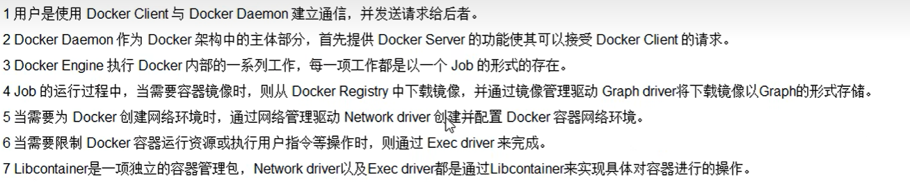

# Docker基础

> Author: Sylvie233
>
> Date: 23/1/16
>
> Point: P66

[TOC]

## 基础介绍


Docker架构




### docker

```
docker:
	--help:
	attach:
	build:
		-t:
	commit:
		-a: 作者
		-m: 描述
	cp: 
	exec:
		-i:
		-t:
	export:
	image:
		prune: 删除虚悬镜像
	images:
		-a:
		-q: 只显示image的id
	import:
	info:
	inspect: 容器详细信息
	kill:
	login:
		--username:
	logs:
	network:
        connect:
        create:
        disconnect:
        inspect:
		ls:
		prune:
		rm:
	ps:
		-a:
		-l: 最近
		-n: 
		-q: 静默模式，只显示id
	pull:
	push:
	restart:
	rm:
		-f:
	rmi:
		-f:
	run: 运行镜像
		-P: 随机端口映射
		-d: 后台运行
		-e: 环境变量
		-i: 以交互式运行
		-p: 端口映射
		-t: 为容器重新分配一个伪输入终端
		-v: 数据卷
		--name:
		--network:
		--privileged: 挂载权限
		--restart: always| （服务与容器重启）
		--volumes-from: 数据卷规则继承
	search:
		--limit:
	start:
	stats:
	stop:
	system:
		df:
	tag:
	top:
	version:
```


### docker-compose

```
docker-compose:
	-h:
	--version:
	config:
	down:
	exec:
	logs:
	ps:
	restart:
	start:
	stop:
	top:
	up:
		-d:
```


## 核心内容

### Dockerfile

```
# 镜像继承
FROM xxx:xxx

MAINTAINER xxx<xxx@xxx>

USER

ENV

# 端口暴露
EXPOSE

# 容器创建后，终端进入的默认目录
WORKDIR

COPY

ADD

VOLUME

# 容器构件时需要执行的命令
RUN

# 与CMD连用
ENTRYPOINT

# 容器启动后执行的命令（最后一个有效）
CMD
```


### docker-compose.yml

```yaml
version: xxx

services:
	xxx:
		image:
		container_name:
		restart:
		environtment:
		links:
		ports:
			-
		volumes:
			-
		networks:
			-
		depends_on:
			-
		command:

networks:
	xxx:
```


### 仓库

配置镜像源：`/etc/docker/daemon.json`

```json
{
    "registry-mirrors": ["https:/xxx.mirror.aliyuncs.com"],
    "insecure-registries": [私有仓库]
}
```


### 镜像

虚悬镜像dangling


### 容器

容器数据卷


## 应用场景

### Portainer可视化


