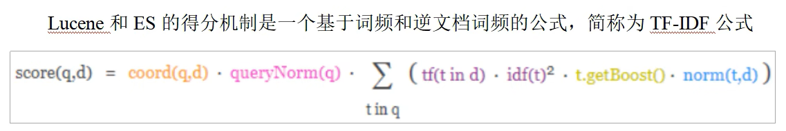
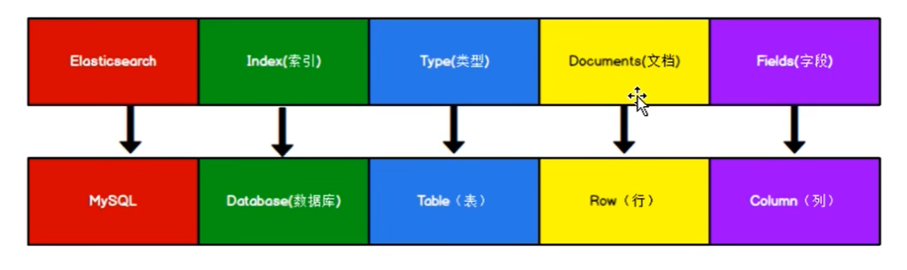
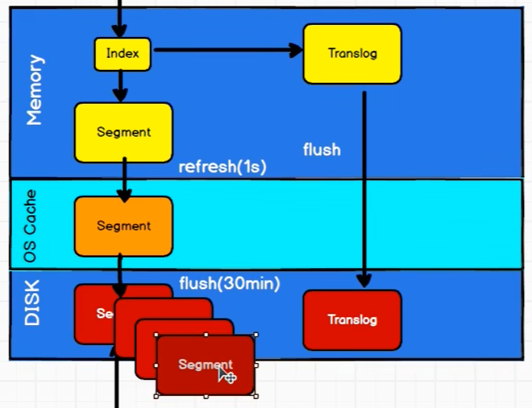
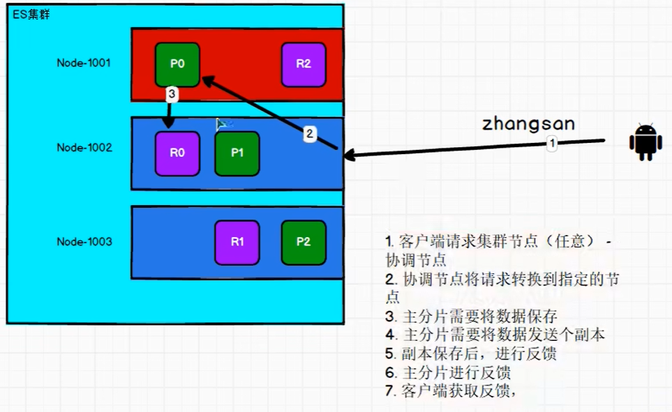
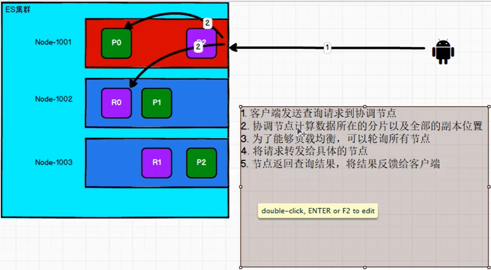
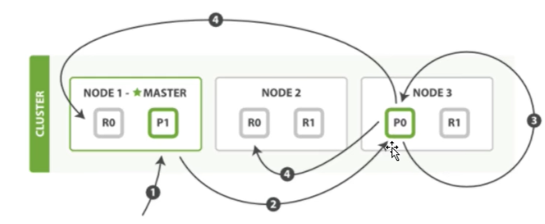

# Elasticsearch基础

> Author: Sylvie233
>
> Date: 23/1/22
>
> Point:

[TOC]

## 基础介绍

Lucene基础


文档得分




安装目录：

```
elasticsearch:
	/bin:
		elasticsearch-certutil
	/config:
		elasticsearch.yml
		custom.dic
	/jdk:
	/lib:
	/logs:
	/modules:
	/plugins:
```


9300端口为集群间组件的通信端口，9200端口为restful接口端口


数据格式：



types弱化移除


文档刷写：




文档分析：

分析器：

- 字符过滤器
- 分词器
- 词汇单元过滤器

ik中文分词器`IKAnalyzer.cfg.xml`

`custom.dic`自定义字典：

```xml
<properties>
	<comment></comment>
    <entry key="ext_dict">xxx</entry>
    <entry key="ext_stopwords">xxx</entry>
</properties>
```


文档控制

并发修改文档时可使用乐观锁添加版本号


### elasticsearch

```
elasticsearch:
	-d:
```


### elasticsearch.yml

```
cluster:
	initial_master_nodes:
	name:
	routing:
		allocation:
			cluster_concurrent_rebalance:
			node_concurrent_recoveries:
			node_initial_primaries_recoveries:
	
gateway:
	recover_after_nodes:

path:
	data:
	logs:

xpack:
	security:
		enabled:
		enrollment:
			enabled:
		http:
			ssl:
				enabled:
				keystore.path:
				truststore.path:


node:
	name:
	master:
	data:


network:
	host:
	tcp:
		keep_alive:
		no_delay:
http:
	cors:
		allow-origin:
		enabled:
	max_content_length:
	port:
action.destructive_requires_name:
transport.tcp:
	port:
	compress:

discovery.seed_hosts: []
discovery.zen.fd.ping_timeout:
discovery.zen.fd.ping_retries:
```


## 核心内容

### Restful

#### DELETE

```
DELETE:
	/xxx: 删除索引
		/_doc:
			/自定义id:
			
```


#### GET

```
GET:
	/_analyze:
		请求对象:
			analyzer: ik_max_word|ik_smart|standard
			text:
		响应对象:
			tokens: []
				token:
				start_offset:
				end_offset:
				type:
				position:
	/_cat:
		/indices: 查看索引
		/nodes:
	/_cluster:
		/health:
	/xxx: 获取索引信息
		/_doc:
			/自定义id:
		/_search:	
			?q: 设置查询条件
			查询对象:
				_source: 映射投影
				aggs:
					xxx名称:
						avg:
						terms: 分组
							field
				bool:
					filter:
						range:
							自定义field:
								gt:
					must: []
						match:
					should: []
						match:
				from:
				highlight:
					fields: []
				query:
					match:
					match_all:
					match_phrase:
				size:
				sort:
					自定义field:
						order
		请求对象:
        	settings:
                analysis:
                	char_filter: 字符过滤器
                		xxx:
                			type:
                			mappings:
                	filter: 词汇单元过滤器
                		xxx:
                			type:
                            stopwords:
                	analyzer:
                		xxx:
                			type:
                			charfilter: 
                			tokenizer: 分词器
                			filter:
                number_of_replicas:
        		number_of_shards:
        		
        		
		响应:
            xxx:
                aliases:
                mappings:
                settings:
                    index:
                        create_date:
                        number_of_shards:
                        number_of_replicas:
                        uuid:
                        version:
                            created:
                        provided_name:
```


#### HEAD

```
HEAD:
	/xxx: 判断索引是否存在
```


#### POST

```
POST:
	/xxx:
		/_doc: 创建文档
			/自定义id:
			响应:
				_index:
				_type:
				_id:
				_version:
				result:
				_shards:
		/_mapping:
			自定义field:
				type: text|keyword|
				index:
		/_update:
			/自定义id
			更新对象:
				
```


#### PUT

```
PUT:
	/_template:
		
	/xxx: 创建索引
		/_bulk:
		/_doc:
			/自定义id:
		响应:
			acknowledged:
			shards_acknowledged:
			index:
```


### JavaAPI

依赖：

```
elasticsearch:
	org.elasticsearch
		elasticsearch
			7.8.0
	org.elasticsearch.client
		elasticsearch-rest-high-level-client
			7.8.0
```


基础使用：

```
RestHighLevelClient cli
	.bulk()
	.close()
	.delete()
	.get()
	.index()
	.indices()
		.create()
		.delete()
		.get()
	.search()
	.update()
		
		
CreateIndexRequest
CreateIndexResponse

GetIndexRequest
GetIndexResponse

DeleteIndexReques
DeleteIndexResponse

IndexRequest
IndexResponse

UpdateRequest
UpdateResponse

GetRequest
GetResponse

DeleteRequest
DeleteResponse

BulkRequest
BulkResponse

SearchRequest
	.indices()
	.source()
		SearchSourceBuilder
			.aggregation()
				AggregationBuilders
					.max()
					.terms()
			.fetchSource()
			.from()
			.highlighter()
				HighlightBuilder
					.preTags()
					.postTags()
			.query()
                QueryBuilders
                	.boolQuery()
                		BoolQueryBuilder
                			.must()
                			.mustNot()
                			.should()
                	.fuzzyQuery()
                		fuzziness()
                    .matchAllQuery()
                    .rangQuery()
                    	RangeQueryBuilder
                    		.gte()
                    		.lte()
                    .termQuery()
                    	TermsQueryBuilder
                    		
            .size()
            .sort()
            	SortBuilder
            		
SearchResponse
	.getHits()
		SearchHits:
			.getTotalHits()
```


### SpringDataAPI

依赖：

```
:
	org.springframework.boot
		spring-boot-starter-data-elasticsearch
```


配置：

```

```


基础使用：

```
配置类
AbstractElasticsearchConfiguration:
	es客户端
	RestHighLevelClient elasticsearchClient():
		
		
		
		
DAO类
ElasticsearchRepository<Entity实体, Long主键>
	
	实例方法:
		delete()
		findAll()
			PageRequest:
				Sort:
		findById()
		save()
		saveAll()
		search():
			QueryBuilders:
				termQuery():
					TermQueryBuilder:
		
		
	
实体类（文档关联）
@Document(
	indexName:
	shards:
	replicas:
)
@Id
@Field(
	type,
	index
)


ElasticsearchRestTemplate template
	.deleteIndex()
```


### SparkAPI

### FlinkAPI


### EQL

### SQL


## API


## 应用场景

### 集群

elasticsearch-head插件查看集群情况

路由计算、分片控制

数据写：



数据读：



数据更新：




master选举流程

zenDiscovery模块选主


## Kibana


