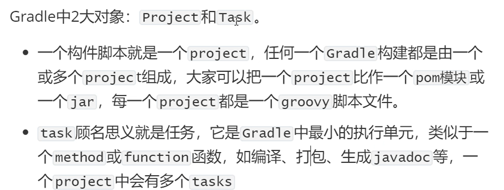
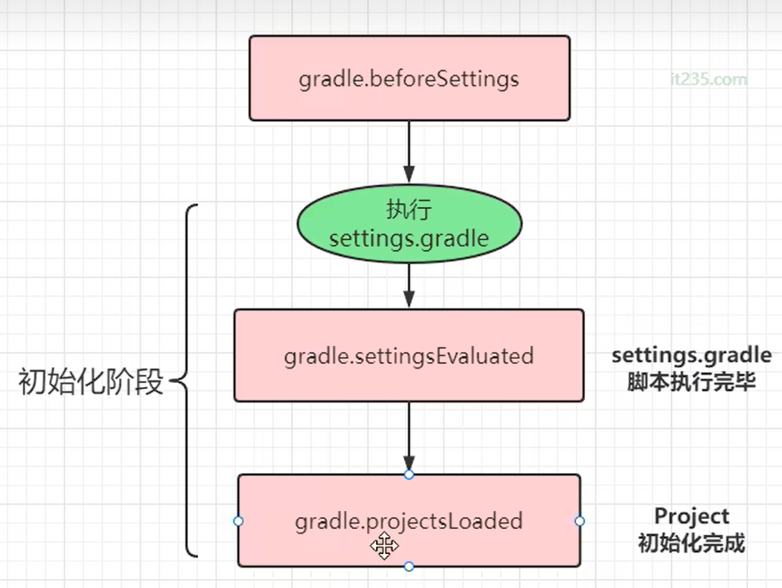
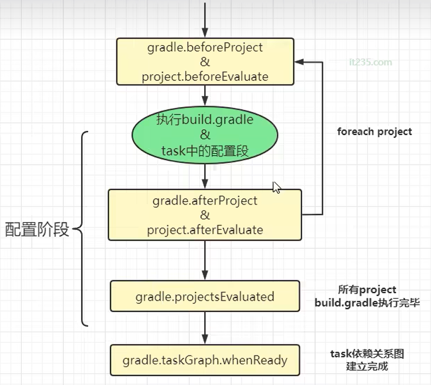
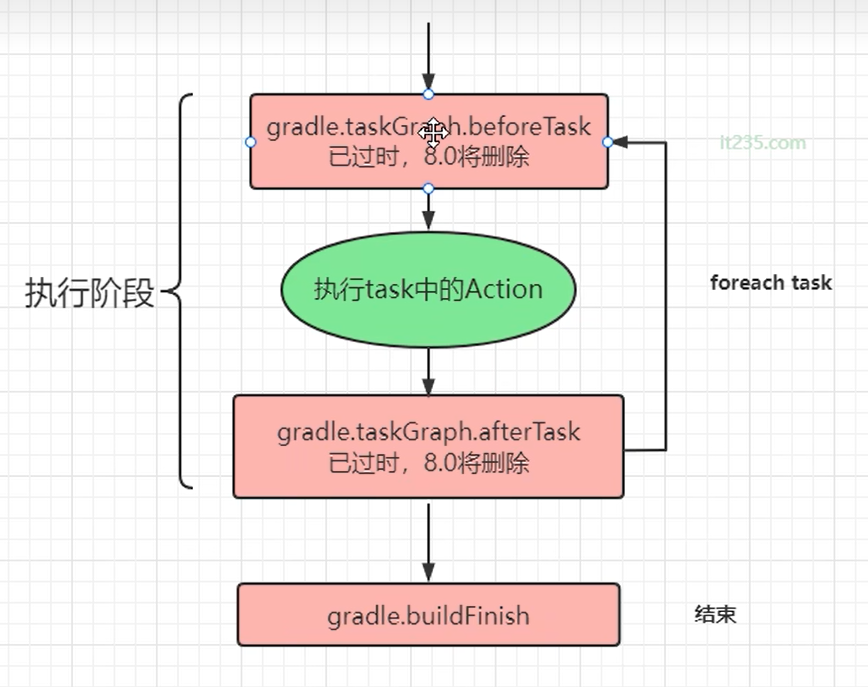
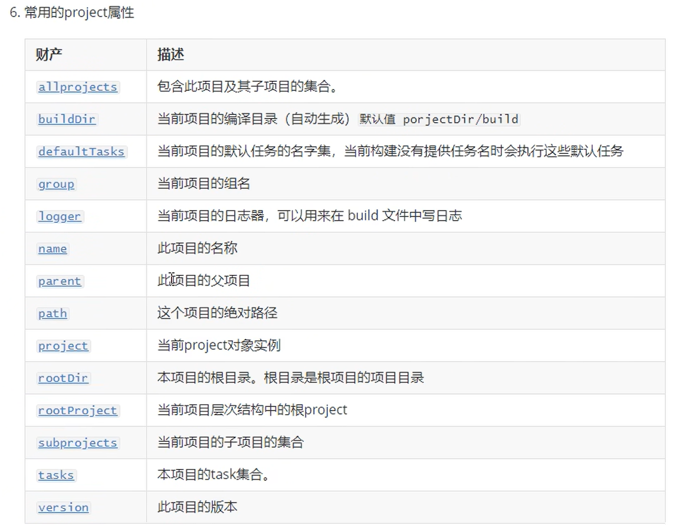
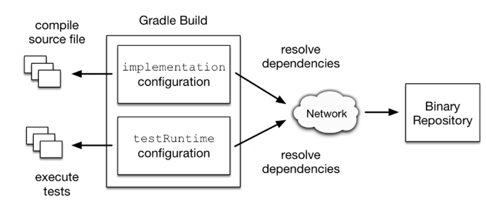
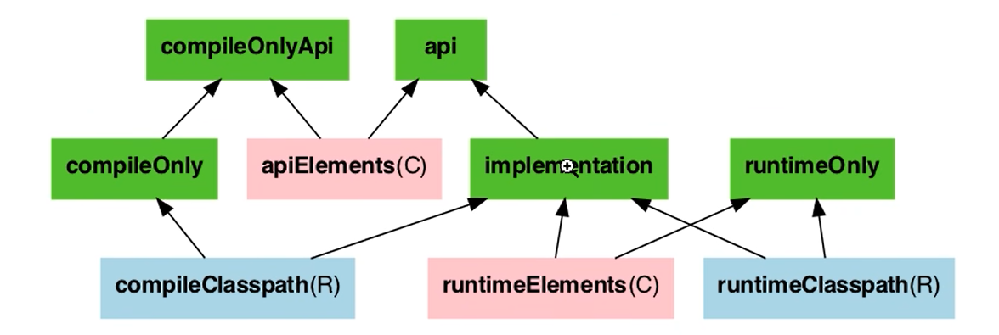
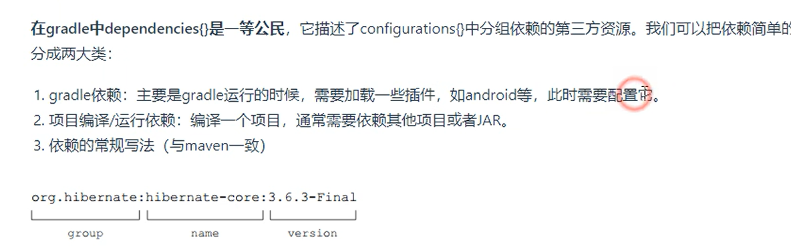

# Gradle基础

> Author: Sylvie233
>
> Date: 23/6/1
>
> Point: 

[TOC]


## 基础介绍





`project`->`task`


### 安装目录

```
:
		
```


#### 工程目录

```
工程目录:
	/.gradle:
	/gradle:
		/wrapper:
			gradle-wrapper.jar:
			gradle-wrapper.properties:
	/src:
		/main:
		/test:
	.gitignore:
	build.gradle:
	gradlew:
	gradlew.bat:
	settings.gradle:
```


`gradle-wrapper.properties`

```
distributionBase=GRADLE_USER_HOME
distributionPath=wrapper/dists
distributionUrl=https\://xxx.xxx/gradle.zip
zipStoreBase=GRADLE_USER_HOME
zipStorePath=wrapper/dists
```


#### build.gradle

```
apply plugin: 'java'


plugins {
	id ‘xxx.xxx’ version "x.x.x"
}


group = "xxx"
version = "xxx"
sourceCompatibility = "1.8"

ext {
	
}


buildscript {
	repositories {
		mavenLocal()
		maven {
			url 'https://maven.aliyun.com/repository/public'
		}
		mavenCentral()
	}
	dependencies {
		classpath "xxx.xxx:xxx:x.x.x"
	}
}

configurations {
	xxx
	xxx.extendsFrom testImplementation
}

allprojects {
	apply plugin: "idea"
	
	dependencyManagement {
		imports {
			mavenBom
		}
	}
	repositories {}
	dependencies {}
}


repositories {
	mavenLocal()
	mavenCentral()
	maven {
		name
		url
		credentials {
			username
			password
		}
	}
	repositories {
		flatDir(
			dirs:
			name:
		)
	}
}

dependencies {
	annotationProcessor
	developmentOnly
	implementation 'xxx:xxx'
	testImplementation 'xxx:xxx'
	implementation("xxx.xxx") {
		exclude "xxx"
		isForce
		transitiveD
	}
}


sourceSets {
	main {
		java {
			srcDirs
		}
		resources {
			srcDirs
			srcDir
			exclude
		}
	}
	xxx {
		compileClasspath += sourceSets.main.output
		runtimeClasspath += sourceSets.main.output
	}
}


tasks.named("test") {
	useJUnitPlatform()
}

application {
	mainClassName = "xxx.xxx.Xxx"
}

test {
	useJUnitPlatform()
}


task xxx(
	type:
) {
	description()
	group()
	
	testClassesDirs
	classpath
	shouldRunAfter test
	mustRunAfter
	
	
	doFirst {
		
	}
	doLast {
	
	}
}


task myJar(
	type: Jar
) {
	baseName "xxx"
	from compileJava.outpus, "sr/main/resources"
	manifest {
		attributes(
			"Manifest-Version": 1.0,
			"Main-Class": "xxx.xxx"
		)
	}
	desinationDir(file("xxx"))
}
artifacts {
	archives myJar
}
```


#### settings.gradle

```
rootProject.name = 'xxx '

include 'xxx子项目'

findProject()


gradle.beforeSettings {}
gradle.settingsEvaluated {}
gradle.projectsLoaded {}


```


### 生命周期

- 初始化阶段
- 配置阶段
- 执行阶段









### gradle

```
gradle指令:
	-d:
	-i:
	-q:
	init:

gradle:
	taskGraph:
	
	addListener():
```


## 核心内容

### project

```
project:
	allprojects:
	buildDir:
	convention:
	ext: 扩展属性
	extensions:
	group:
	logger:
	name:
	parent:
	path:
	project:
	projectDir:
		absolutePath:
	rootDir:
	rootProject:
	subprojects:
	tasks:
		addRule():
		create():
		findByPath():
		getByPath():
			path:
		register():
		with():
		withType():
	version:	
	property():
	---
	
 
---
常用方法:
	copy():
		from:
		into:
	defaultTasks()
	fileTree():	
	flatDir():
	println():
	project():
```




### plugins

```
plugins:
	
```


### buildscript

```
buildscript:
	
```


### configurations

```
configurations:
	xxx:
		asPath:
		files:
			first():
			last():
```






### repositories

```
repositories:
	
```


### denpendencies

```
denpendencies:
	
```




### allprojects

```
allprojects:
	
```


### subprojects

```
subprojects:
	
```


### sourceSets

```
sourceSets:
	
```


### artifacts

```
artifacts:
	
```


### task

```
task:
	dependsOn:
	description:
	enabled:
	group:
	mustRunAfter: 指定任务执行顺序	
	overwrite:
	type:
		Copy:
			from:
			into:
			rename:
		Zip:
			from:
			into:
			
	with: 使用闭包
	---
	doFirst {}
	doLast {}
```


#### DefaultTask


#### TaskAction

```
:
	@Input:
	@TaskAction:
```


#### Rule


### 插件

#### 自定义插件

##### Plugin

```
Plugin:
	apply():
		Project:
```


## Android

`build.gradle`

```
apply plugin: 'com.android.application'
apply plugin: 'kotlin-android'
apply plugin: 'kotlin-android-extensions'
apply plugin: 'kotlin-kapt'

android {
	compileSdkVersion 29
	
	defaultConfig {
		applicationId "xxx.xxx"
		minSdkVersion 23
		targetSdkVersion 29
		versionCode 1
		versionName "1.0"
		multiDexEnabled
		testInstrumentationRunner "androidx.test.runner.AndroidJUnitRunner"
	}
	
	buildTypes {
		release {
			minifyEnabled false
			shrinkResources false
			proguardFiles
		}
	}
	
	compileOptions {
		sourceCompatibility JavaVersion.VERSION_1_8
		targetCompatibility JavaVersion.VERSION_1_8
	}
	
	buildToolsVersion '29.0.3'
}

dependencies {
	
}
```


