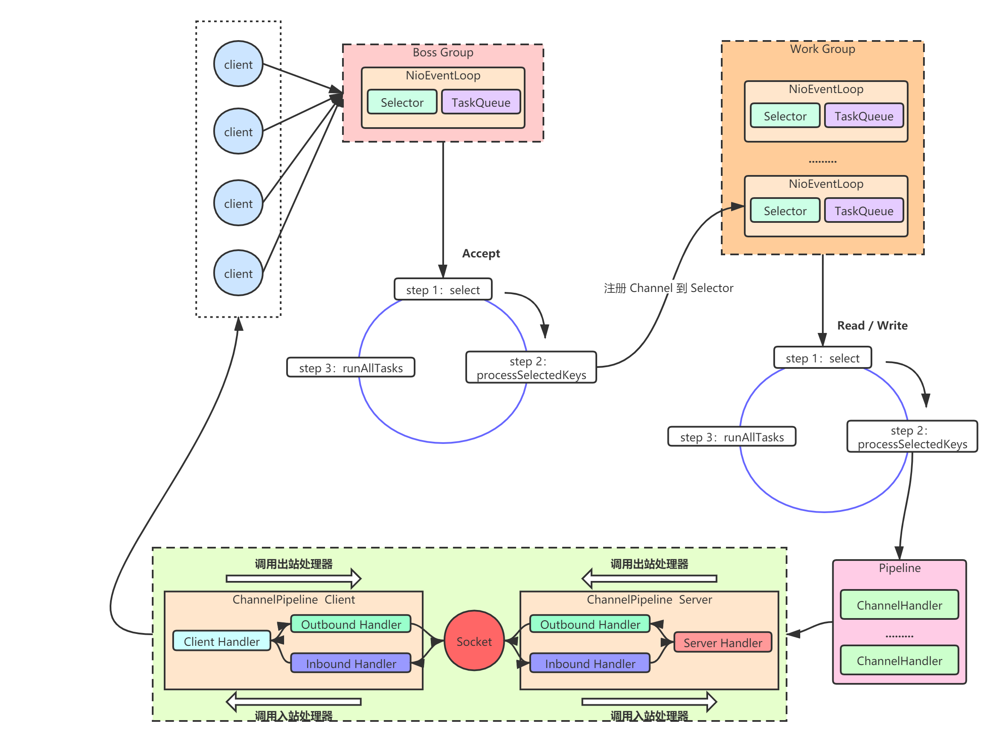
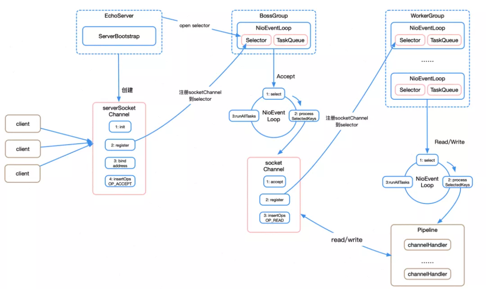
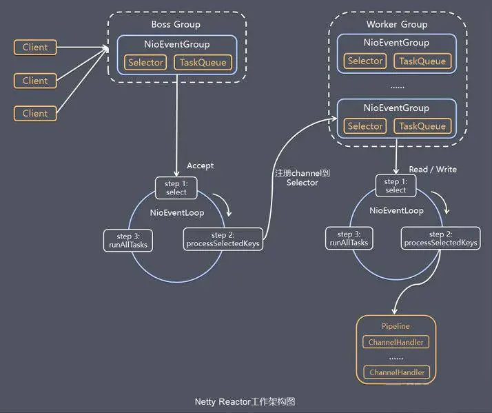
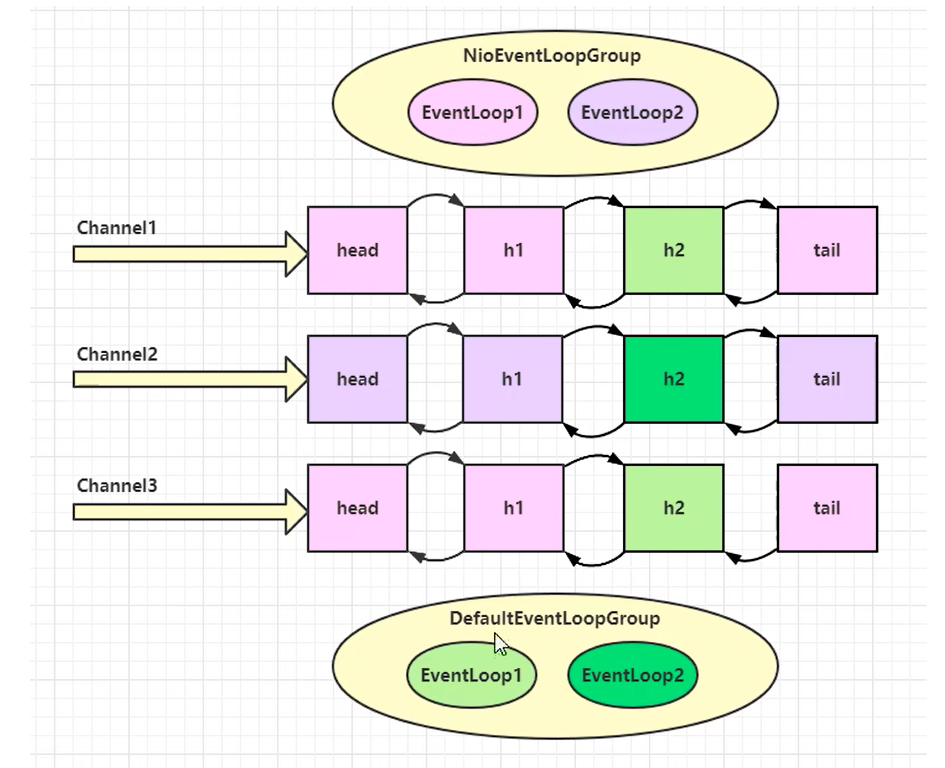
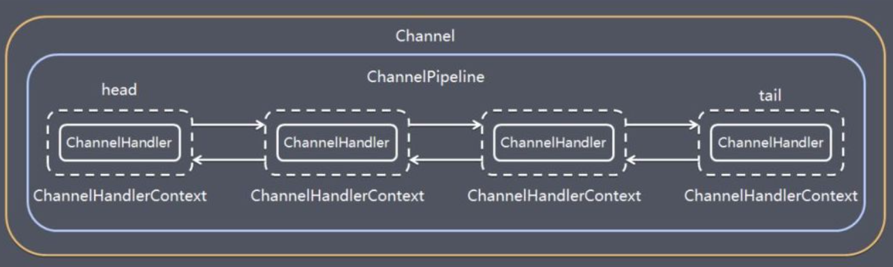
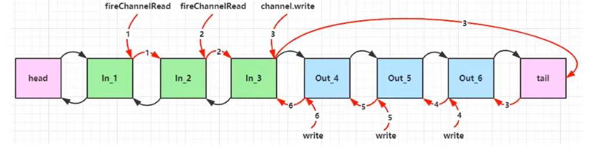
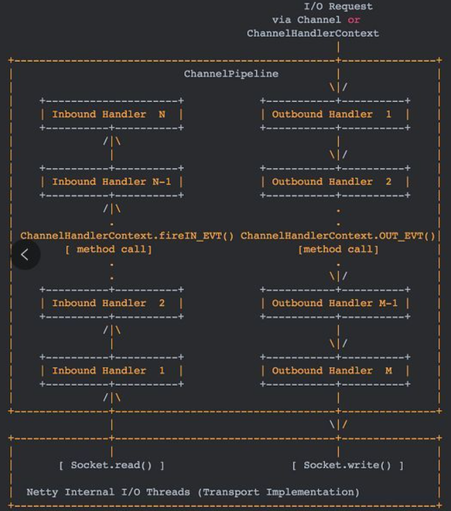
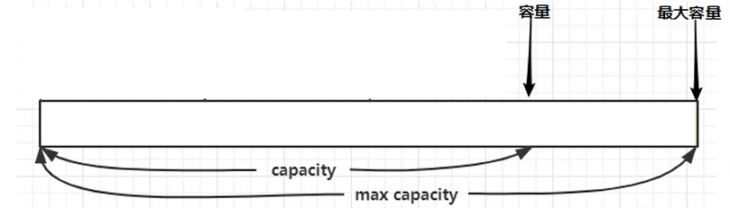

# Netty基础

Sylvie233的Java基础学习~~~

> Author: Sylvie233
>
> Date: 2023/1/3
>
> Point: 
> 	千锋教育Netty入门视频教程：P50


## 基础介绍
### NIO

NIO通信
![[Pasted image 20240221230647.png]]


客户端断线重连、心跳处理、半包处理


### 核心组件


Netty结构









EventLoopGroup -> Selector - >SelectionKey -> Channel -> Pipeline -> Handler -> 操作ByteBuffer

Channel也表示Socket


#### EventLoopGroup
可构建父子级关系


selector+thread+任务队列(Queue\<Runnable>)

单线程执行器，维护了一个Selector

EventLoop负责监听网络事件并调用事件处理器进行相关I/O操作的处理


eventloop->channel->pipeline->handle




#### Channel




##### ChannelFuture
异步结果


##### ChannelPipeline

入站处理器、出站处理器





Head handler、Tail handler



##### ChannelHandler
具体实现：编解码


InboundHandler入栈处理、OutboundHandler出栈处理


#### ByteBuf

读指针、写指针




池化


bytebuf的释放


## 核心内容
NIO非阻塞I/O

### Reactor模型

#### 事件响应式

![[Pasted image 20240222232655.png]]


#### 多线程模型

![[Pasted image 20240222233319.png]]

#### 多主多重模型

![[Pasted image 20240222234852.png]]


### 编解码


#### 粘包分包


### 心跳机制
超时检测


### 断线重连


## API

```
io.netty:
	bootstrap: 辅助启动类
		Bootstrap: 
			channel():
			connect():
			group():
			option():
			handler():
		ServerBootstrap:
			bind(): 绑定端口，异步启动
			channel():
			childOption():
			group():
			handler():
			option():
	buffer:
		ByteBuf:
			toString():
		Unpooled: ByteBuf操作工具类
			buffer():
			copiedBuffer():
	channel:
		nio:
			NioEventLoopGroup:
		socket:
			nio:
				NioServerSocketChannel:
			SocketChannel:
				pipeline():
		ChannelFuture:
			addListener():
			isSuccess():
			sync():
		ChannelHandler:
			bind():
			channelActive(): 处理激活事件
			channelRead(): 处理读事件
			channelReadComplete(): 处理读完事件
			channelInactive(): 处理非激活事件
			channelWritabilityChanged(): 处理写状态变化事件
			close():
			connect():
			disconnect():
			exceptionCaught(): 异常捕获处理
			flush():
			handlerAdded():
			handlerRemoved():
			read():
			write():
		ChannelHandlerAdapter: 常通过继承适配器来实现Channel处理方法
		ChannelHandlerContext:
			channel():
			executor():
			handler():
			name():          
			pipeline():
			writeAndFlush(): 写出数据到通道中
		ChannelHandlerInvoker: 最终调用方法
			executor():
			invokeChannelRead():
			invokeChannelReadComplete():
			invokeClose():
			invokeRead():
			invokeWrite():
			invokeFlush():
		ChannelInboundHandler:
		ChannelInboundHandlerAdapter:
		ChannelInitializer: 继承了ChannelHandlerAdapter
			initChannel(): 初始化ChannelHandler
		ChannelOption:
			SO_BACKLOG:
		ChannelOutboundHandler:
		ChannelOutboundHandlerAdapter:
		ChannelPipeline:
			addFirst():
			addLast():
		DefaultChannelPipeline: ChannelPipeline的默认实现
			HeadHandler:
			TailHandler:
			
		EventLoop: 继承EventExecutor接口
			next():
			parent():
		EventLoopGroup:
			next():
	util:
		concurrent:
			EventExecutor:
				children():
				inEventLoop():
				next():
				parent():
				schedule():
				submit(Callable):
			EventExecutorGroup:
				next():
				shutdown():
				schedule():
				submit(Callable):
			Future:
			GenericFutureListener:
		AttributeKey:

java:
	nio:
		channels:
			SelectionKey:
				OP_ACCEPT:
				OP_CONNECT:
				OP_READ:
				---
				channel():
				isAcceptable():
				isReadable():
			ServerSocketChannel:
				accept():
				configureBlocking():
				register():
				socket():
				
			Selector:
				selectedKeys():
			SocketChannel:
				open():
				---
				register():
		ByteBuffer:
			array():
```


### bootstrap

#### ServerBootstrap


### buffer

#### ByteBuf

#### ByteBufAllocator


### channel

#### nio

##### NioEventLoopGroup

io事件、普通任务、定时任务


#### socket

##### nio

###### NioServerSocketChannel

###### NioSocketChannel


#### ChannelHandlerContext

#### ChannelInboundHandlerAdapter

#### ChannelInitializer

#### EventLoopGroup


### util

#### NettyRuntime