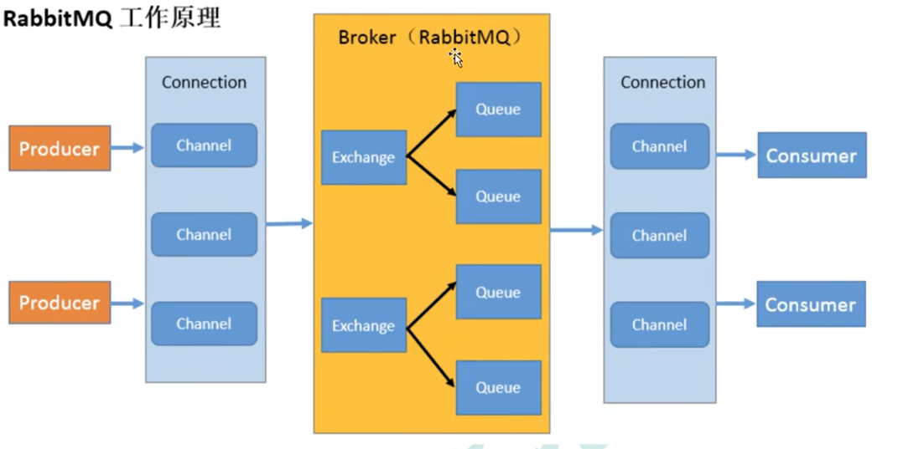
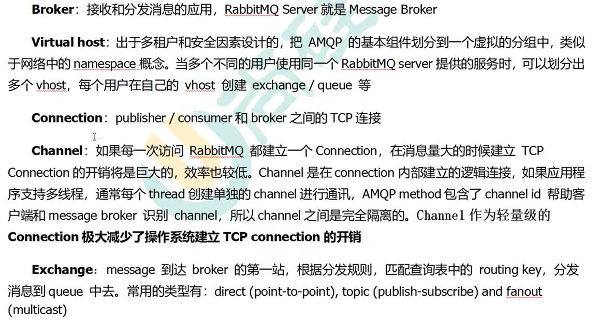
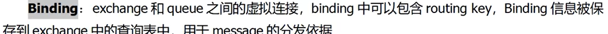
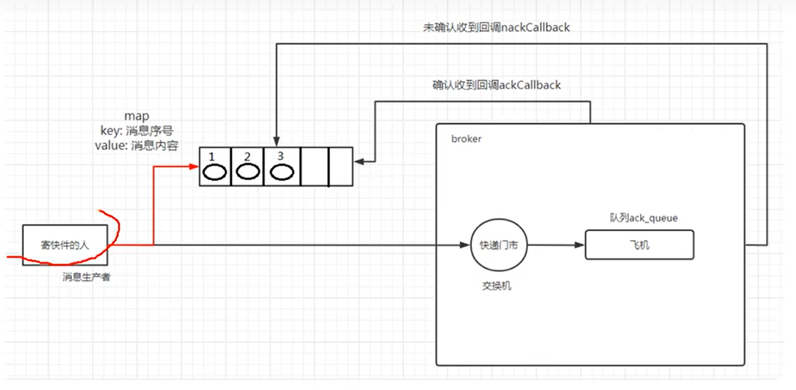
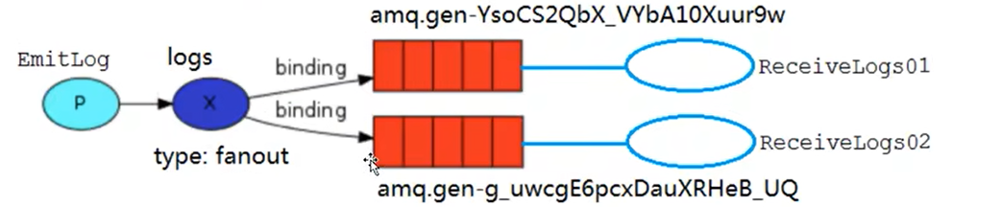
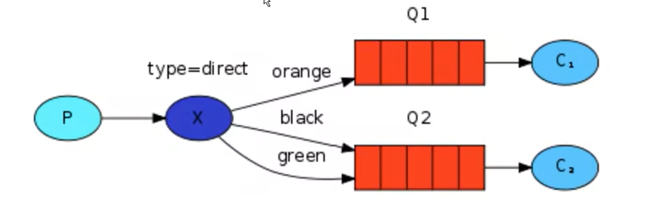
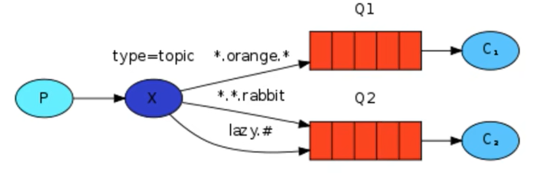
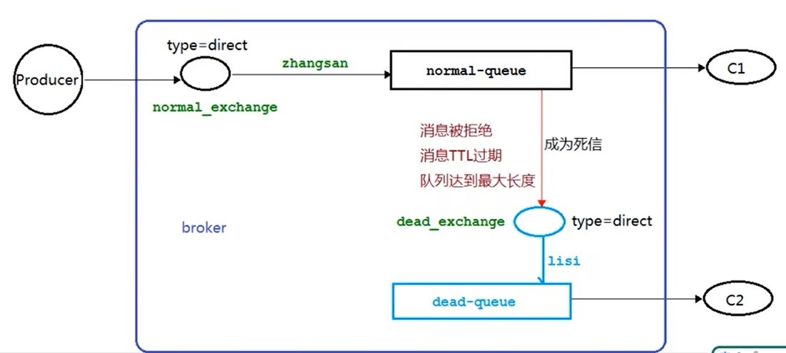
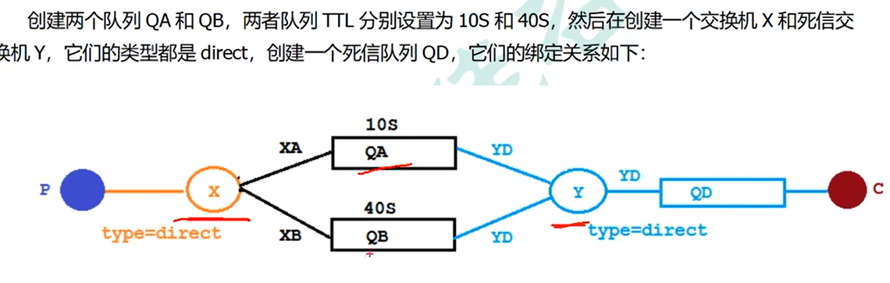
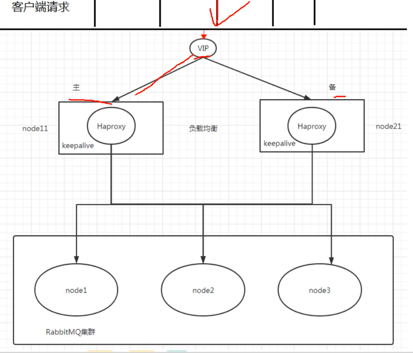

# RabbitMQ基础

> Author: Sylvie233
>
> Date: 23/1/20
>
> Point:

[TOC]

## 基础介绍

生产者、交换机、队列、消费者








vhost类似数据库的概念


六大模式：

- Hello World
- Work queues
- Publish/Subscribe
- Routing
- Topic
- publisher Confirms


erlang语言编写


server5672端口

web ui界面15672端口


### 安装目录

```
rabbitmq:
	
```


java依赖：

```
rabbitmq依赖：
	com.rabbitmq
		amqp-client
			5.8.0
			
springboot集成：
	org.springframework.boot
		spring-boot-starter-amqp
	org.springframework.amqp
		spring-rabbit-test
```


### rabbitmqctl

```
rabbitmqctl:
	add_user:
	cluster_status:
	forget_cluster_node:
	join_cluster:
	list_users:
	reset:
	set_permissions:
	set_user_tags:
	start_app:
	stop_app:
	
```


### rabbitmq-server

```
rabbitmq-server:
	-detached:
	
```


### rabbitmq-plugins

```
rabbitmq-plugins:
	enable:
		rabbitmq_delayed_message_exchange
		rabbitmq_management
		
```


## 核心内容


### Producer

基础使用：

```
ConnectionFactory factory
	.setHost()
	.setUsername()
	.setPassword()
	
Connection conn = factory.nweConnection()
Channel channel = conn.createChannel()

// 使用默认交换机，声明使用队列
channel.queueDeclare(name, durable, exclusive, autoDelete, args)

// 发布消息
channel.basicPublish(exchange, routingKey, props, body)
```


发布确认

单个发布确认、批量发布确认、异步发布确认

```
channel.confirmSelect()
	.waitForConfirms()
	.addConfirmListener(ackCb, nackCb)
```

异步确认




SpringBoot集成

```
RabbitTemplate rabbitTemplate
	.convertAndSend()
```


发布确认高级

rabbitmq服务器宕机

生产者注册回调接口（**交换机接收不到消息**）

```
rabbitMqTemplate.setConfirmCallback()

确认回调
RabbitTemplate.ConfirmCallback:
	confirm(CorrelationData, boolean ack, String cause)
		CorrelationData保存Message消息相关信息

```

配置发布确认模式：

```
spring.rabbitmq.publisher-confirm-type= correlated|simple|none
```


注册回退消息接口（**队列接收不到消息**）

```
rabbitMqTemplate.setReturnCallback()

回退回调
RabbitTemplate.ReturnCallback:
	returnedMessage(Message, int replyCode, String replyText, String exchange, String routingKey):
```


### Consumer


基础使用：java客户端

```
channel.basicConsume(queue, autoAck, consumerTag, deliverCb, cancelCb)

```


工作线程、工作队列Work Queues


消息应答

自动应答，手动应答

```
channel.basicAck()
```


SpringBoot集成

```
@RabbitListener(queues)
	(Message, Channel):
		
```


### Exchange

默认交换机：AMQP default


类型：

- direct
- topic
- headers
- fanout


binding绑定队列

routingKey、bindingKey

Binding

BindingBuilder


Fanout交换机

广播队列



```
channel.exchangDeclare(name, type)
	.queueBind(queueName, exchangeName, routingKey)
```


Direct交换机



使用routingKey进行路由到指定队列中


DirectExchange


Topic交换机



多级单词的Key，可使用通配符


备份交换机

交换机的`alternate-exchange`属性


### Queue

临时队列


死信队列

消息TTL过期、队列达到最大长度、消息被拒绝



设置参数：

- x-dead-letter-exchange
- x-dead-letter-routing-key
- x-message-ttl
- x-max-length


AMQP.BasicProperties


```
channel.basicReject()
```


延迟队列

消息ttl过期，延迟队列基于死信队列实现



rabbitmq插件实现延迟队列

rabbitmq-plugins enable rabbitmq_delayed_message_exchange

在交换机中延迟，而不是在队列中延迟

CustomExchange自定义交换机、Message消息中定义ttl（而不是给queue队列定义ttl）


优先级队列

队列`x-max-priority`属性，给消息设置priority优先级的值


惰性队列

消息保存在磁盘中

`x-queue-mode`属性值为lazy


## 应用场景

### RabbitMQ持久化

队列持久化

消息持久化


不公平分发

prefetchCount

```

channel.basicQos(prefetchCount)
```


### RabbitMQ集群


镜像队列

添加策略：

- `ha-mode`：
- `ha-params`：
- `ha-sync-mode`：

队列名匹配自定义策略


HAProxy实现负载均衡




Federation Exchange联邦交换机

```
rabbitmq-plugins enable rabbitmq_federation rabbitmq_federation_management
```

downstream、upstream


Federation Queue联邦队列


Shovel

```
rabbitmq-plugins enable rabbitmq_shovel rabbitmq_shovel_management
```


## API