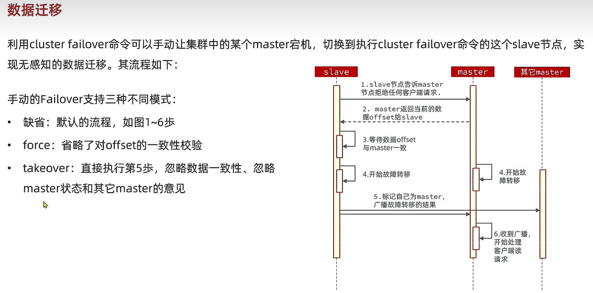

# Redis基础

> Author: Sylvie233
>
> Date: 23/1/5
>
> Point：黑马程序员Redis教程P146

[TOC]

## 基础介绍

默认16个库


key分组：冒号分隔


Jedis客户端、luttuce客户端

pipeline批处理


### redis-server

```
redis-server:
	配置文件.conf:
	
```


### redis-cli

```
redis-cli:
	-a: 密码
	-h: 主机
	-p: 端口
	--cluster:
		nodes:
		reshape:
		shutdown:
	shutdown: 关闭服务
```


### redis配置文件

```
# redis.conf

	bind 0.0.0.0
	daemonize yes
	databases 1
	dir .
	logfile "redis.log"
	maxmemory 512mb
	port 6379
	requirepass 123456
	
	
	save 300 100
	dbfilename xxx.rdb
	rdbcompression yes
	
	
	appendonly yes
	appendfilename "xxx.aof"
	appendfsync always/no/everysec
	
	sentinel announce-ip x.x.x.x
	
	
	cluster-enalbed yes
	cluster-config-file xxx.conf
```


### Redis命令

#### auth

#### bgsave

#### bitcount

#### bitfield

#### bitfield_ro

#### bitop

#### bitpos

#### blpop

#### brpop

#### client

#### cluster

#### decr

#### del

#### eval

#### exists

#### expire

#### geoadd

#### geodist

#### geohash

#### geopos

#### geosearch

#### geosearchstores

#### get

#### getbit

#### help

```
help:
	@xxx: 查看特定组group的命令
		generic: 通用命令
		string: 查看string相关命令
```

#### hget

#### hgetall

#### hincrby

#### hkeys

#### hmget

#### hmset

#### hset

#### hsetnx

#### hvals

#### incr

#### incrby

#### incrbyfloat

#### keys

```
keys:
	*: 查看当前库的所有key
```

#### lpop

#### lpush

#### lrange

#### mget

#### mset

#### pfadd

#### pfcount

#### pfmerge

#### ping

#### psubscribe

#### publish

#### rpop

#### rpush

#### sadd

#### save

#### scard

#### sdiff

#### select

#### set

#### setbit

#### setex

#### setnx

#### sinter

#### sismember

#### slaveof

#### smembers

#### srem

#### subscribe

#### sunion

#### ttl

#### xack

#### xadd

#### xgroup

#### xlen

#### xpending

#### xread

#### xreadgroup

#### zadd

#### zcard

#### zcount

#### zdiff

#### zincrby

#### zinter

#### zrange

#### zrangebyscore

#### zrank

#### zrem

#### zrevrange

#### zrevrank

#### zscore

#### zunion


## Redis核心

### String

### List

### Hash

### Set

### SortedSet

score属性排序


### GEO

### BitMap

### HyperLogLog

基于概率统计，有误差


## Redis应用

### 持久化

RDB、AOF


### 集群

主从集群

全量同步


增量同步


哨兵


分片集群

散列插槽

16384个插槽

key的hash值对应的插槽在哪个redis节点上


故障转移




hash_tag

批处理：


### 秒杀


判断秒杀库存、检验一人一单


异步下单，使用队列


### 缓存穿透

redis和mysql中都为空值的情况


解决办法：缓存null值、布隆过滤


缓存击穿：热点key问题

使用互斥锁处理、逻辑过期处理


多级缓存：


### 缓存雪崩

同一时段内大量的缓存key失效或redis宕机，导致大量请求到达数据库


多级缓存


JVM进程缓存

Caffeine本地缓存库（java8编写）


### 分布式锁


#### redisson

分布式锁原理


可重入锁


可重入、可重试、超时续约


主从一致性

redis的multilock联锁


### 消息队列

基于list结构模拟消息队列

使用`brpop`阻塞获取list元素


pubsub消息队列


stream消息队列

redis5.0引入的一种新数据类型

消费者组


### redis底层结构

SDS动态字符串


IntSet


Dict


ZipList


QuickList


SkipList


RedisObject


