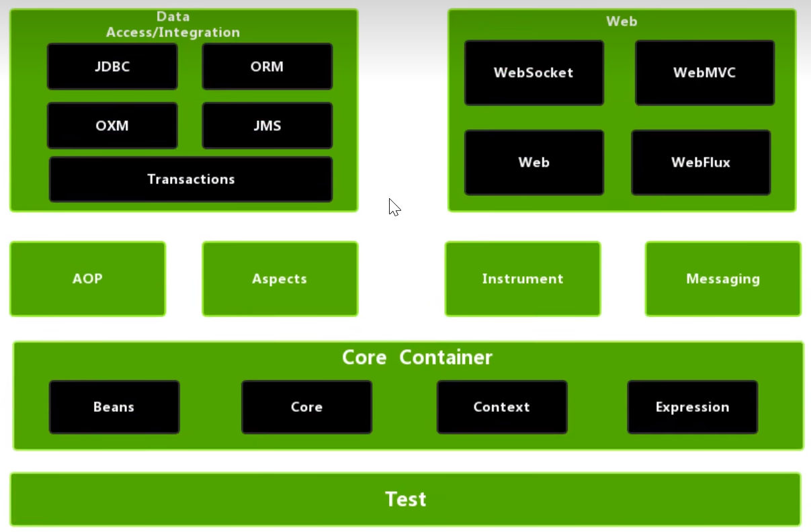

# Spring

> Author: Sylvie233
>
> Date: 23/7/26
>
> Point:
>
> ​	Spring6教程：P32
>
> ​	SSM练手小项目：P33
>
> ​	Spring5底层教程：P36

[TOC]

## 基础介绍

Spring Framework轻量级开源框架

IOC、AOP

非侵入式




Spring6最低要求JDK17


## 核心内容

### Spring

ApplicationContext、BeanFactory


BeanFactory后置处理器解析注解（注入容器）：@Configuration、@Autowired、@Resource、


@Lazy单例对象解决办法：使用代理创建对象


#### beans.xml

```
<beans>
	<bean
		id:
        class:
	>
		<property
			name:
			value:
			ref: 引用外部Bean
		>
			<value>
				![CDATA[ ... ]]: 特殊字符
			<null>
			<bean>: 内部Bean
			<array>
				<value>
			<list>
				<ref
					bean
				>
			<map>
				<entry>
					<key>
						<value>
					<value>
					<ref bean>
		<constructor-arg
			name:
			index:
			value:
		>
	<context:>
		annotaion-config:
		conponet-scan: 组件扫描
		property-placeholder: 引入外部properties文件
			location:
	<p:>: property属性快速赋值
	<util:>
		list:
			<ref>
		map:
```


#### 注解

```
:
	
```


#### IoC

DI（依赖注入）实现了IoC（控制反转）

setter注入、构造注入


bean生命周期


#### AOP


### SpringMVC

#### web.xml

```
<web-app>
	<listener>
		<listener-class>
			org.springframework.web.context.ContextLoaderListener
	<context-param>
		<param-name>
			contextConfigLocation
		<param-value>
			classpath:application.xml: 加载Spring Bean核心
	<servlet>
		<servlet-name>
		<servlet-class>
			org.springframework.web.servlet.DispatcherServlet
		<init-param>
			<param-name>
				contextConfigLocation
			<param-value>
				加载MVC xml配置
		<load-on-startup>
			1
	<servlet-mapping>
		<servlet-name>
		<url-pattern>
			/
```

Tomcat的war项目启动配置文件


##### application.xml

```
<beans>
	<context:component-scan base-package />
	
	<bean id="multipartResolver" />
	
	<bean class="org.springframework.web.servlet.handler.BeanNameUrlHandlerMapping" />
	<bean class="org.springframework.web.servlet.mvc.SimpleControllerHandlerAdapter" />
	<bean class="org.springframework.web.servlet.view.InternalResourceViewResolver" id="internalResourceViewResolver">
		<property name="prefix"/>
		<property name="suffix"/>
		
	<mvc:annotaion-driven>
		<mvc:message-converters>
			<bean>: 自定义Json转换
			
	<mvc:interceptors>
		<mvc:interceptor>
			<mvc:mapping path>
			<mvc:exclude-mapping path>
			<bean>
			
	<context:annotation-config /> 添加默认BeanFactory后置处理器（5个）
	<context:property-placeholder location>
	<mybatis:scan base-package>
	<bean id="dataSource">
	<bean id="sqlSessionFactory">
	<bean id="transactionManager">
	
	<tx:advice id="txAdvice" transaction-manager="transactionManager">: 声明式事务
		<tx:attributes>
			<tx:method name propagation>
		
	<aop:aspectj-autoproxy />
```


#### 字段校验

@Validated、BindingResult（获取校验结果）


#### 拦截器


## API

```
org.springframework:
	beans:
		factory:
			annotatin:
				AutowiredAnnotatinBeanPostProcessor: Bean后置处理器
					getOrder(): 处理器顺序
					postProcessProperties():
					setBeanFactory():
				InjectionMetadata:
					inject(): 注入容器
				Value:
			config:
				BeanDefinition: Bean定义信息
				BeanFactoryPostProcessor: BeanFactory后置处理器(context.refresh()时执行)
					postProcessBeanFactory():
				DependencyDescriptor: 注解字段依赖封装
				DestructionAwareBeanPostProcessor:
				InstantiationAwareBeanPostProcessor:
					postProcessBeforeDestruction():
					postProcessBeforeInstantiatin():
					postProcessProperties(): 解析依赖注入注解
			support:
                BeanDefinitionBuilder:
                	addConstructorArgValue():
                	genericBeanDefinition():
                	getBeanDefinition():
                	setAutowireMode(): 自动装配模式
                	setFactoryMethodOnBean():
                	setInitMethodName():
                    setScope():
				BeanDefinitionReader:
				BeanDefinitionRegistry:
				BeanDefinitionRegisterPostProcessor:
					postProcessBeanDefinitionRegistry():
				BeanNamGenerator:
					generateBeanName():
				DefaultBeanNamGenerator:
				DefaultListableBeanFactory:
					addEmbeddedValueResolver():
					doResolveDependency(): 注入依赖解析
					registerBeanDefinition():
					registerSingleton():
					setAutowireCandidateResolver():
				DefaultSingletonBeanRegistry:
			xml:
            	XmlBeanDefinitionReader: Bean加载器
            BeanFactory:
                addBeanPostProcessor(): 添加Bean后置处理器（注解解析）
            	containsBean():
            	getBean():
            	getBeansOfType():
            	getDependencyComparator():
            	isSingleton():
            	preInstantiateSingletons(): 预生成单例Bean实例
            BeanNameAware:
            	setBeanName():
            InitializingBean:
            	afterPropertiesSet():
            ObjectFactory:
	boot:
		context:
			properties:
				ConfigurationProperties:
				ConfigurationPropertiesBindingPostProcessor:
					register():
		web:
			servlet:
				context:
					AnnotaionConfigServletWebServerApplicationContext: 基于Web注解（ServletWebServerFactory、DispatcherServlet、DispatcherServletRegistraionBean（注册到Server））
	cglib: 父子代理
		core:
		proxy:
			Enhancer:
				create():
	context:
		annotation:
			AnnotationBeanNameGenerator:
			AnnotationConfigApplicationContext: 基于注解配置类
			AnnotationConfigUtils:
				registerAnnotationConfigProcessors(): 给BeanFarcory添加注解解析扩展
			Configuration: 配置类
			Bean: Bean类
			ComponentScan:
				Filter:
			ConfigurationClassPostProcessor: （@ComponentScan、@Import）
			FilterType:
			internalAutowireAnnotationProcessor: 注解解析处理器
				postProcessBeanFactory(): 为BeanFactory中的Bean解析注解
			internalCommonAnnotationProcessor:
			internalConfigurationAnnotationProcessor:
			Lazy:
			Scope: Bean作用域
				proxyMode:
				---
				request:
				session:
				application:
				
		event:
			EventListener:
			internalEventListenerFactory:
			internalEventListenerProcessor:
		support:
			
			ClassPathXmlApplicationContext: 基于类路径获取xml文件
			FileSystemXmlApplicationContext: 基于磁盘路径获取xml文件
            GenericApplicationContext:
            	close(): 销毁容器
            	getDefaultListableBeanFactory():
            	getResources():
            	registerBean(): 注册Bean
            	refresh():  初始化容器（执行BeanFactory后置处理器、添加Bean后置处理器、初始化所有单例）
            	
		ApplicationContext: Bean上下文
			getBean():
			getBeanFactory():
			getEnvironment(): 环境变量
			getMessage():
			getResources():
			publishEvent():
		ApplicationAware:
			setApplicationContext():
		ApplicationEvent:
		ApplicationEventPublisher:
			publishEvent():
		ConfigurableApplicationContext:
			getBeanDefinitionNames():
		MessageSource: 国际化信息
			getMessage():
	core:
		annotation:
			AliasFor:
			AnnotatinUtils: 注解工具类
				findAnnotation():
			AnnotationAwareOrderComparator:
		env:
			EnvironmentCapable:
		io:
			PathMatchingResourcePatternResolver:
				getResources():
		type:
			classreading:
				CachingMetadataReaderFactory:
					getMetadataReader():
				
				MetadataReader:
					getClassMetadata():
						getClassName():
					getAnnotationMetadata():
						getAnnotatedMethods():
						hasAnnotation():
						hasMetaAnnotation():
			ClassMetadata:
					isInterface():
            MethodMetadata:
                getAnnotationAttributes():
	data:
		domain:
			Page:
			PageRequest:
	http:
		ResponseEntity:
	stereotype:
		Component: 组件
	validation:
		annotation:
			Validated: 字段校验注解
		BindingResult:
			getAllErrors():
	web:
		bind:
			annotaion: WEB注解
				CrossOrigin: 跨域处理
				GetMapping:
				RequestBody:
				ResponseBody:
				RestController:
				Validated:
		client:
			RestTemplate:
				getForEntiry():
		servlet:
			mvc:
				Controller:
					handleRequset():
			HandlerInterceptor:
				preHandle():
				postHandle():
				afterCompletion():
	
org.aspectj:
	lang:
		annotation:
			Aspect: AOP注解
			Before:

com.alibaba.druid:
	pool:
		DruidDataSource:
```


