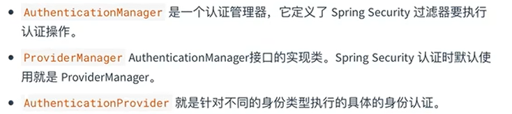
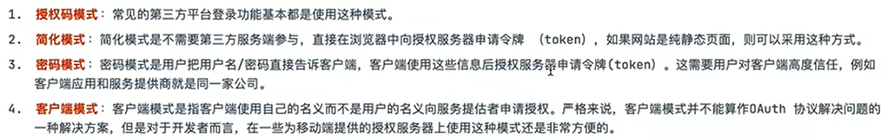

# SpringSecurity基础

> Author: Sylvie233
>
> Date: 23/1/17
>
> Point: P72

[TOC]

## 基础介绍


依赖：

```
org.springframework.boot
	spring-boot-starter-security
```


Filters实现：


默认filters

```
filters:
	WebAsyncManagerIntegrationFilter
	SecurityContextPersitenceFilter
	HeaderWriterFilter
	CsrfFilter
	LogoutFilter
	UsernamePasswordAuthenticationFilter
	DefaultLoginPageGenerationFilter
	DefaultLogoutPageGeneratingFilter
	BasicAuthenticationFilter
	RequestCacheAwareFilter
	SecurityContextHolderAwareRequestFilter
	AnonymousAuthenticationFilter
	SessionManagementFilter
	ExceptionTransiationFilter
	FilterSecurityInterceptor
```


默认登录页面生成：


认证管理器：（责任链模式）


### RememberMe

AbstractAuthenticationProcessingFilter

RememberMeAuthenticationFilter

RememberMeServices的autoLogin()方法、onLoginSuccess()、

TokenBasedRememberMeServices实现类processAutoLoginCookie()

PersistentTokenBasedRemeberMeServices实现类processAutoLoginCookie()生成令牌


PersistentTokenRepository根据series查询token值


cookies令牌值


Token令牌持久化

JdbcTokenRepositoryImpl


### 会话管理

SessionManagementFilter

SessionAuthenticationStrategy


HttpSessionEventPublisher

会话共享：SpringSession、Redis

SpringSessionBackedSessionRegistry

FindByIndexNameSessionRepository


### CSRF

csrf令牌，服务端生成


CsrfFilter

CookieCsrfTokenRepository实现类的loadToken()方法

请求头X-XSRF-TOKEN或请求参数\_csrf


### CORS


CorsConfigurationSource

UrlBasedCorsConfigurationSource


### 异常处理


## 核心内容

### SpringBootWebSecurityConfiguration

自动配置类

默认拦截所有请求


### AuthenticationManager

Authentication

```

```


**AuthenticationManager认证管理**

将传入的AuthenticationToken进行认证处理

ProviderManager

AuthenticationProvider




DaoAuthenticationProvider调用UserDetailService进行认证


认证流程：


前后端分离认证：


### UserDetailService

根据用户名获取用户信息

数据源

UserDetailServiceAutoConfiguration自动配置


**UserDetailManager用户信息管理**

InmemoryUserDetailsManager（基于内存的数据源）


UserDetail、User


### PasswordEncoder

密码比较器

DelegatingPasswordEncoder密码比较器代理


### WebSecurityConfigurerAdapter

Security项目配置

```
WebSecurityConfigurerAdapter:
	configure(HttpSecurity http):
		http.authorizeHttpRequest()
			.mvcMatchers("/xxxx").permitAll()
				.hasRole()
				.hasAuthority()
				.hasAnyAuthority()
				.hasAnyRole()
				.hasPermission()
				.antMatchers()
				.regexMatchers()
			.anyRequst.authenticated()
			.and()
			.formLogin()
			.loginPage()
				.loginProcessingUrl()
				.usernameParameter()
				.passwordParameter()
			.logout()
				.logoutUrl()
				.invalidateHttpSession()
				.logoutSuccessUrl()
				.clearAuthentication()
				.logoutRequestMatcher()
				.logoutSuccessHandler()
			.successForwardUrl()
				.defaultSuccessUrl()
				.successHandler()
			.failureUrl()
				.failureForwardUrl()
				.failureHandler()
			.csrf().disable()
				.csrfTokenRepository()
			.addFilterAt()
			.exceptionHandling()
				.authenticationEntryPoint()
				.accessDeniedHandler()
			.rememberMe()
				.key()
				.alwaysRemember()
				.rememberMeParameter()
				.rememberMeServices()
				.tokenRepository()
			.sessionManagement()
				.maximumSessions()
				.expireUrl()
				.expiredSessionStrategy()
				.maxSessionPreventsLogin()
				.sessionRegistry()
			.cors()
				.configurationSource()
			.oauth2Login()
				
    
    initialize(AuthenticationManagerBuilder, DataSource):
    configure(AuthenticationManagerBuilder):
    	builder.userDetailsService()
    		.authenticationProvider()
    		
    		
    authenticationManagerBean():
```


AuthenticationSuccessHandler认证登录成功处理

AuthenticationFailureHandler认证登录失败处理

默认错误信息存在request、session中


LogoutSuccessHandler注销成功处理


### SpringContextHolder


SpringContextHolderStrategy

策略设计模式

SpringContext


### AccessDecisionManager

FilterSecurityInterceptor过滤器实现权相比较，用户授权在Authentication认证时已完成


GrantedAuthority

权限管理策略


@EnableGlobalMethodSecurity


### ConfigAttribute

SecurityMetadataSource


动态权限分配

自定义实现<u>FilterInvocationSecurityMetadataSource的getAttributes()方法</u>获取保存资源访问映射的权限（角色）信息

```
ApplicationContext appCtx = http.getSharedObject(ApplicationContext.class)

http.apply(new UrlAuthorizationConfigurer<>(appCtx))
	.withObjectPostProcess(new ObjectPostProcessor<FilterSecurityInterceptor>() {
		public <O extends FilterSecurityInterceptor> O postProcess(O object) {
			object.setSecurityMetadataSource(自定义SecurityMetadataSource)
			// 是否拒绝公共资源的访问
			object.setRejectPublicInvocations(false)
			return object
		}
	})
```

FilterInvocation当前请求对象

AntPathMatcher路径匹配器


## API


## OAuth2


四种授权模式：




一、授权码模式


二、简化模式


三、密码模式


四、客户端模式


标准接口：


github第三方登录

配置id

```
spring:
	seurity:
		oauth2:
			client:
				registraion:
					github:
						client-id:
						client-secret:
						redirect-uri: /login/oauth2/code/github
```


依赖

```
oauth2:
	org.springframework.boot
		spring-boot-starter-oauth2-client
```


DefaultOAuth2User


OAuth2LoginAuthnticationFilter处理OAuth2认证

请求默认url为`/login/oauth2/code/*`

ClientRegistrationRepository的findByRegistrationId()方法查看该第三方是否在本地注册，获取appid和密钥


OAuth2AuthorizationCodeGrantFilter处理OAuth2认证中授权码

BearerTokenAuthenticationFilter处理OAuth2认证的Access Token


### SpringSecurityOAuth2

自定义授权、资源服务器

依赖：

```
org.springframework.cloud
	spring-cloud-starter-oauth2
		2.2.5.RELEASE
```


Authentication Server配置

```
@EnableAuthorizationServer

自定义AuthorizationServerConfigurerAdapter实现

	授权服务器配置客户端
	configure(ClientDetailsServiceConfigurer clients):
		clients.inMemory()
			.withClient()
			.secret()
			.redirectUris()
			.authorizedGrantType()
			.scopes()
			
			.jdbc()
			.withClientDetails()
			
	configure(AuthorizationServerEndpointsConfigurer endpoints):
    	endpoints.userDetailsService()
    		.authenticationManager()
    		.tokenStore()
    		.tokenServices()
    		.accessTokenConverter()
    		
    	配置token服务
    	DefaultTokenServices tokenServices
    		.setTokenStore()
    		.setSupportRefreshToken()
    		.setReuseRefreshToken()
    		.setClientDetailsService()
    		.setTokenEnhancer()
    		.setAccessTokenValiditySeconds()
    		.setRefreshTokenValiditySeconds()
```


请求授权：`/oauth/authorize`

获取code授权码

根据授权码code获取Token令牌：`/oauth/token`

获取access_token令牌


认证结果告知AuthorizationManager集成进SpringSecurity


刷新Token

防止令牌过期

获取refresh_token


令牌存储（ClientDetails、Token、）

ClientDetailsService

JdbcClientDetailsService


TokenStore

JdbcTokenStore


集成JWT令牌

TokenStore

JwtTokenStore

JwtAccessTokenConverter

ClientDetailsService

JdbcClientDetailsService


资源服务器和授权服务器使用同一个TokenStore（JwtTokenStore），共享Token信息


资源服务器

依赖：

```
org.springframework.security
	spring-security-oauth2-resource-server
```


配置

```
@EnableResourceServer

ResourceServerConfigurerAdapter
	configure(ResourceServerSecurityConfigurer resources):
		resources.tokenStore()
			.
```


