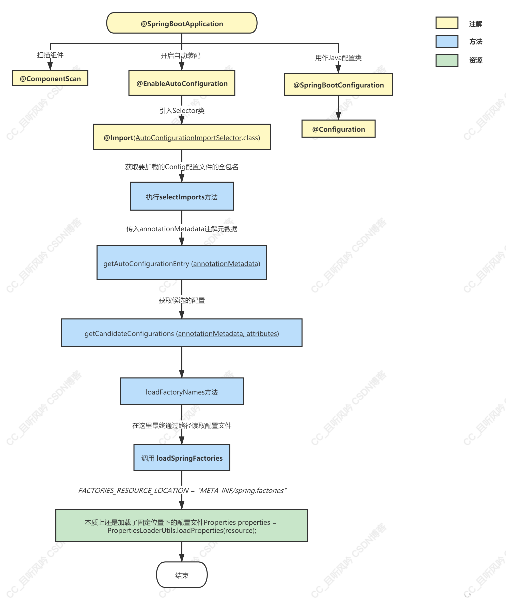
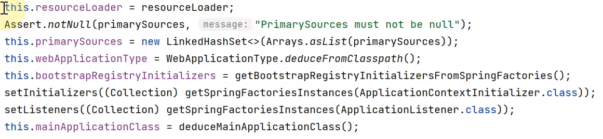
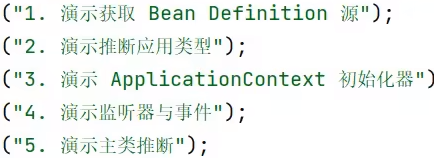
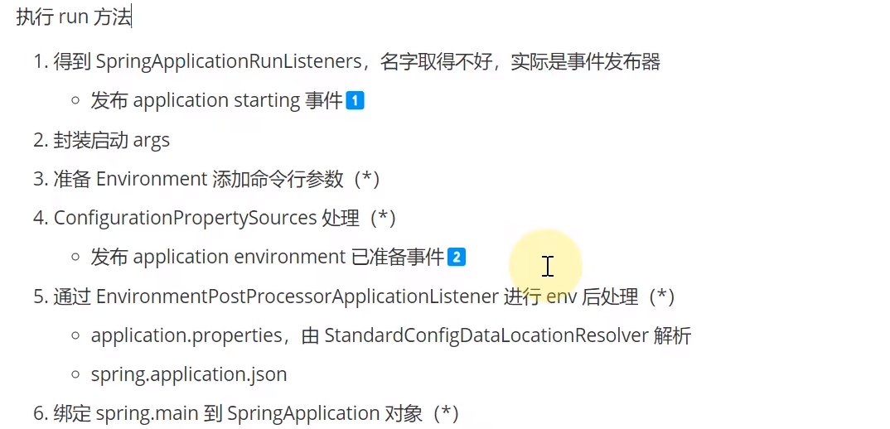
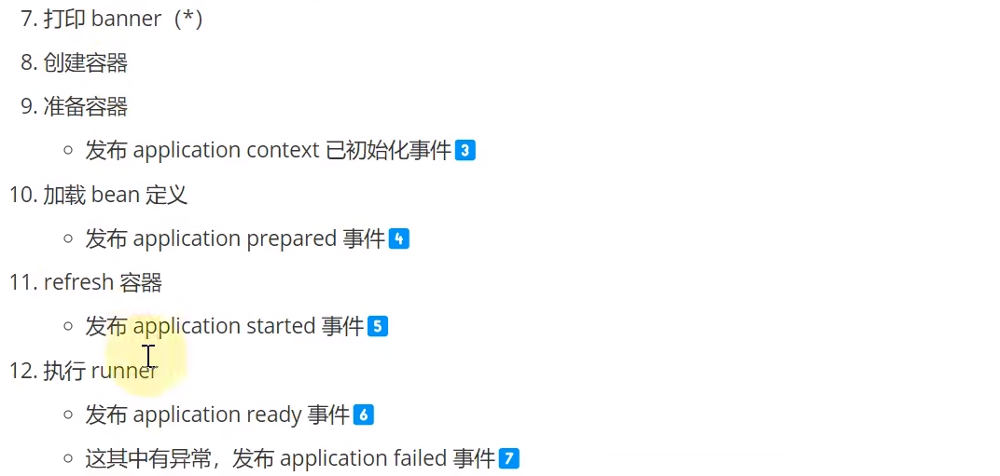
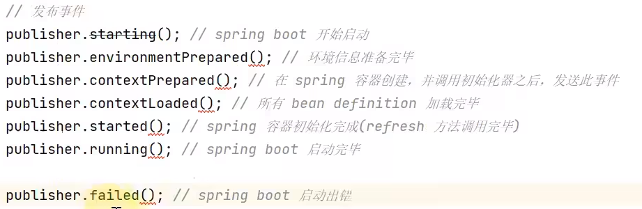
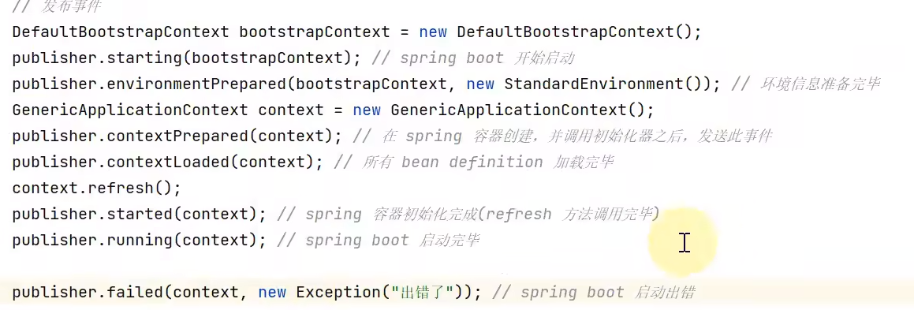
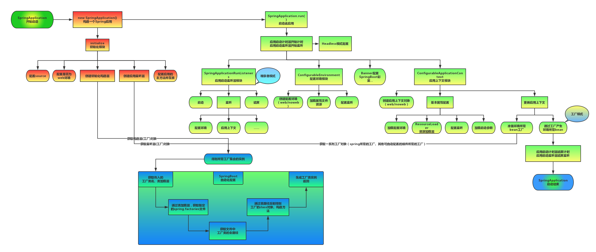
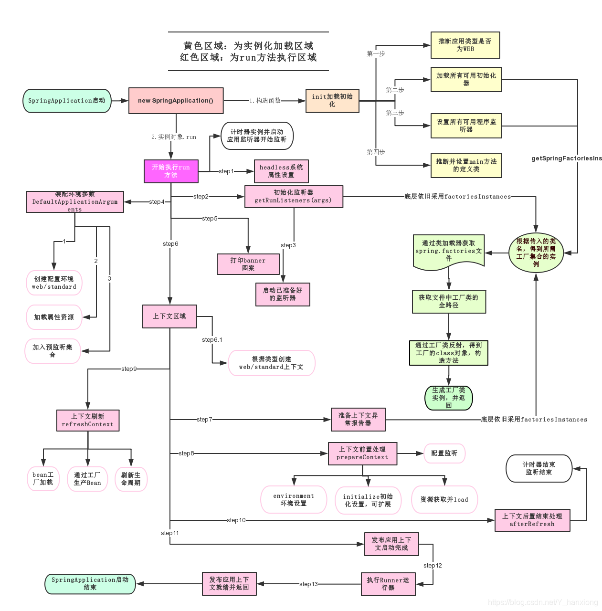
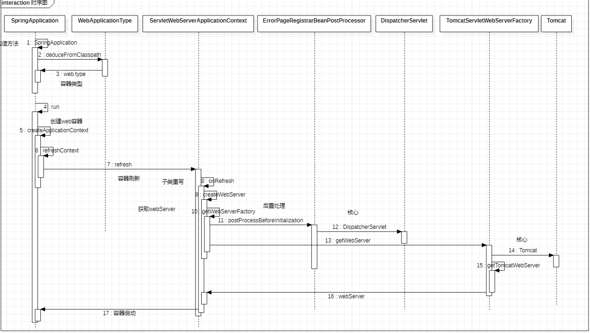

# SpringBoot3

> Author: Sylvie233
>
> Date: 23/7/28
>
> Point:
>
> ​	SpringBoot3教程：P3


## 基础介绍

### 自动装配

自动配置的Selector在**解析@Configuration注解时执行**




#### starter

`spring-boot-starter`、`spring-boot-autoconfigure`

条件注解开启starter功能


#### 构造





添加Bean来源、在初始化器中扩展Application、初始化Application监听器


#### run()






##### ApplicationEvent

Application事件发布（7个事件）





##### ApplicationListener


##### ApplicationEnvironment

准备Application环境配置







##### SpringMVC





##### Runner

Application启动后执行自定义任务


## 核心内容

```
org.springframework.boot:
	autoconfigure:
		web:
			servlet:
				
		SpringBootApplication:
	SpringApplication:
```


## 第三方库


