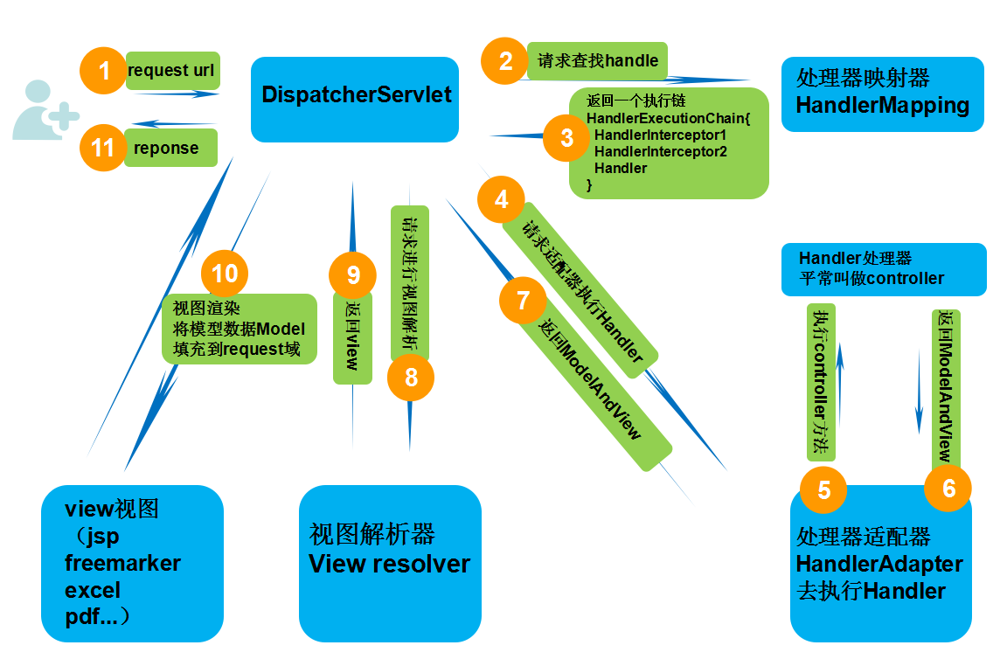

# SpringBoot3

> Author: Sylvie233
>
> Date: 23/7/28
>
> Point:
>
> ​	SpringBoot3教程：P8

[TOC]

## 基础介绍

### 自动装配


#### starter

`spring-boot-starter`、`spring-boot-autoconfigure`

条件注解开启starter功能


#### run()


！()[]


##### SpringMVC




## 核心内容

```
org.springframework.boot:
	autoconfigure:
		web:
			servlet:
				
		SpringBootApplication:
	SpringApplication:
```


## 第三方库


