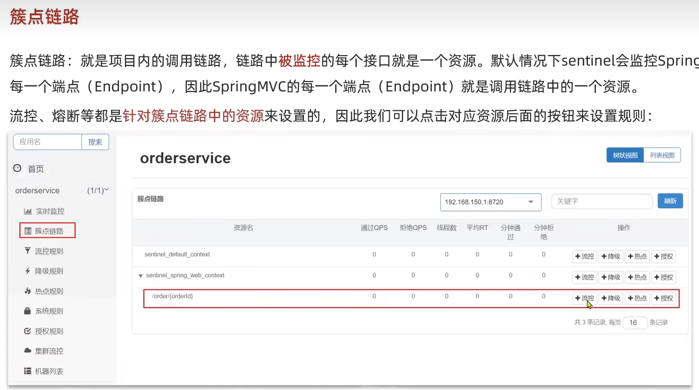
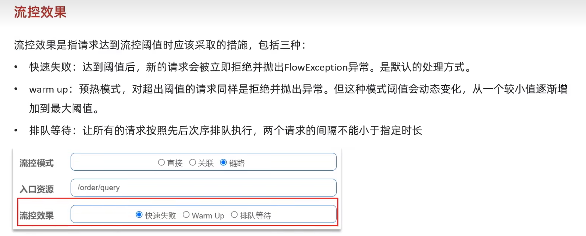
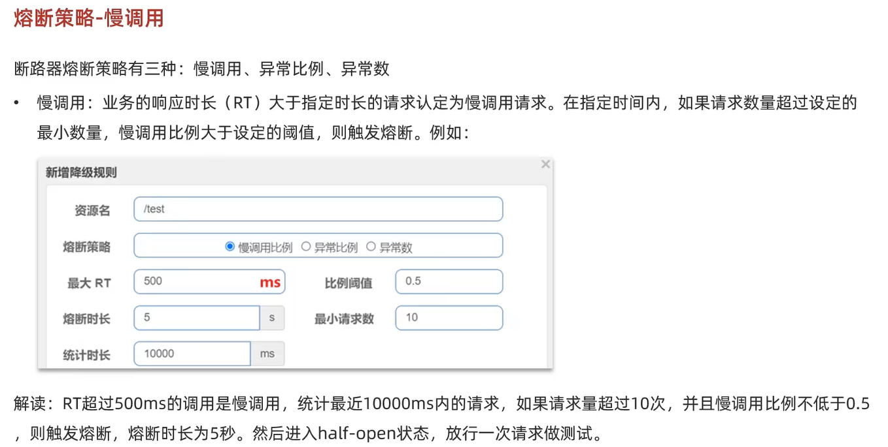
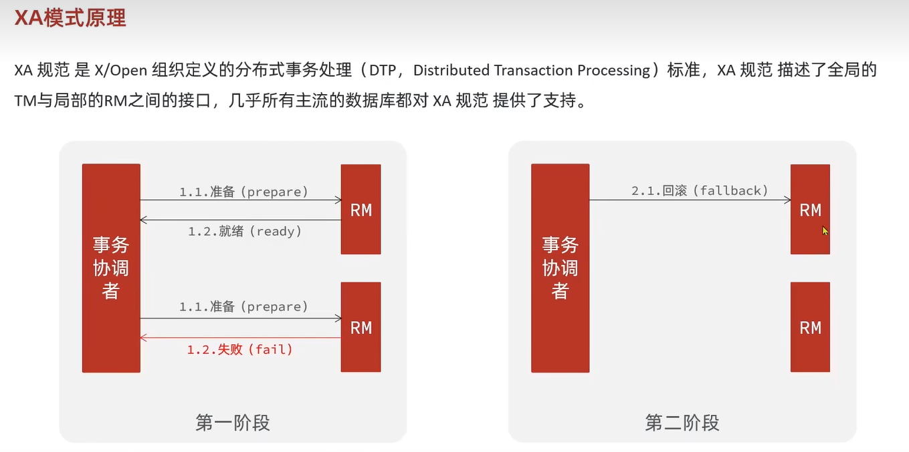

# SpringCloud基础

> Author: Sylvie233
>
> Date: 23/1/31
>
> Point: P150

[TOC]

## 基础介绍

微服务架构


微服务架构演变


微服务技术栈


## 核心内容

### Eureka

服务注册


依赖

```
eureka服务端：
    org.springframework.cloud:
        spring-cloud-starter-netflix-eureka-server
	
eureka客户端：
	org.springframework.cloud:
        spring-cloud-starter-netflix-eureka-client
```


配置

```
eureka:
	client:
		service-url:
			defaultZone: "xxx/eureka"
			
xxx服务名:
	ribbon:
		NFLoadBalancerRuleClassName: 自定义Ribbon的Rule
		
ribbon:
	eager-load: 饥饿加载(预加载)
		enabled: true
		clients: xxx服务名
```


eureka服务端

```
@EnalbeEurekaServer
```


eureka客户端 

服务发现

```
@LoadBalanced
RestTemplate restTemplate():
```


Ribbon负载均衡，http请求拦截


Ribbon实现原理


自定义负载均衡策略IRule


### Nacos

注册中心、配置中心


jar包


```
startup:
	-m:
		standalone:
		
```


nacos@nacos

WebUI界面


服务分级存储


NacosRule负载均衡规则：优先访问本地集群，集群内随机

设置集群内实例的权重


环境隔离namespace


public默认命名空间

不同namespace下的服务不可见


依赖

```
nacos客户端：
	com.alibaba.cloud:
		spring-cloud-starter-alibaba-nacos-discovery

nacos配置管理：
	com.alibaba.cloud:
		spring-cloud-starter-alibaba-nacos-config
```


配置

```
spring:
	cloud:
		nacos:
			server-addr: xxx:8848
			discovery:
				cluster-name: xxx集群名
				namespace: 命名空间ID
				ephemeral: false（设置为非临时实例）
```


nacos客户端

```
@LoadBalanced
```


配置管理


配置热更新

```
@RefreshScope
```


bootstrap.yml

```
spring:
	application:
		name: xxxservice
	profiles:
		active: dev
	cloud:
		nacos:
			server-addr:
			config:
				file-extension: yaml|
```


nacos集群


### Feign

依赖：

```
:
	org.springframework.cloud
		spring-cloud-starter-openfeign
```


基础使用

```
@EnableFeignClients

@FeignClient():
	@GetMapping():
```


配置

```
feign:
	client:
		config:
			default:
				loggerLevel:
	httpclient:
		enabled:
		max-connections:
		max-connections-per-route:
```


### Gateway


依赖

```
:
	org.springframework.cloud:
		spring-cloud-starter-gateway
```


基础使用


配置

```
spring:
	cloud:
		gateway:
			routes:
			  - id: xxxservice
				uri: lb://xxxservice
				predicates:
				  - Path=/xxx/xxx 
				  - After=
				  - Before=
				filters:
				  - AddRequestHeader=
			defaulte-filters:
			  - 
			globalcors:
				add-to-simple-url-handler-mapping:
				corsConfiguraions:
					'[/**]':
						allowedOrigins:
						allowedMethods:
						allowedHeaders:
						allowCredentials:
						maxAge:
```


路由断言工厂


路由过滤器

过滤器工厂

全局过滤器GlobalFilter


CORS配置


### RabbitMQ

Spring AMQP


依赖

```
:
	org.springframework.boot:
		spring-boot-starter-amqp
```


配置

```
spring:
	rabbitmq:
		host:
		port:
		virtual-host:
		username:
		password:
		listener:
			simple:
				perfetch: 1
```


RabbitTemplate

```
RabbitTemplate:
	convertAndSend():
```


基础使用

```
消费者：
	@RabbitListener():
		queues:
		bindings:
			@QueueBinding():
				value:
					@Queue():
						name:
				exchange:
					@Exchange():
						name:
						type:
				key: {}
```


消息转换器

MessageConvert


### Redis


### Elasticsearch


### Sentinel

雪崩问题：超时处理、舱壁模式、熔断降级、流量控制


Sentinel控制台

Web界面、Jar包

配置

```
sentinel:
	dashboard:
		auth:
			username:
			password:
			
server:
	port:
	
spring:
	cloud:
		sentinel:
			transport:
				dashboard:
			web-context-unify: false
			datasource:
				flow:
					nacos:
						server-addr:
						dataId:
						groupId:
						rule-type:
			
feign:
	sentinel:
		enabled: true
```


依赖

```
:
	com.alibaba.cloud:
		spring-cloud-starter-alibaba-sentinel
```


基础使用：

```
@SentinelResource(): 标记资源

// Feign的降级逻辑处理
FallbackFactory<Feign的Client>:
	Feign的Client create(Throwable):
		return new Feign的Client() {
			Feign的Client的 失败降级的处理逻辑
		}

// 注册逻辑工厂
@Bean
FallbackFactory<Feign的Client>:

// Feign使用逻辑工厂
@FeignClient(fallbackFactory)
```


功能列表

- 实时监控
- 簇点链路
- 流控规则
- 降级规则
- 热点规则
- 系统规则
- 授权规则
- 集群流控
- 机器列表


簇点链路



流控规则


流控模式


关联模式 


链路模式


流控效果




热点参数限流


线程隔离

信号量隔离、线程池隔离


降级熔断

Feign集成Sentinel：注册一个降级处理的Feign代理


熔断策略




授权规则


区分origin实现：请求头


自定义异常结果


规则持久化


push模式实现

```
:
	com.alibaba.csp
		sentinel-datasource-nacos
```


### Seata

分布式事务

CAP定理：CP、AP


BASE理论


子事务通信：子事务协调者


Seata解决方案


TC服务：全局事务协调者

配置托管registry.conf：交给nacos托管

```
registry {
	type = "nacos"
	nacos {
		application = 
		serverAddr
		group = 
		namespace = 
		cluster = 
		username = 
		password = 
	}
}

config {
	type = "nacos"
	nacos {
		serverAddr
		group = 
		namespace = 
		username = 
		password = 
		dataId =
	}
}
```


事务管理配置：借助数据库存储子事务信息

```
store:
	mode:
	db:
		dbType:
		driverClassName:
		url:
		user:
		password:
		minConn:
		mxConn:
		globalTable: 全局事务存储
		branchTable: 分支事务存储

server:
	recover:
	
transport:
	serialization:
	compressor:

metrics:
	enabled:
    registryType:
```


微服务集成Seata依赖

```
:
	com.alibaba.cloud
		spring-cloud-starter-alibaba-seata
	io.seata
		seata-spring-boot-starter
```


使用

```
@GlobalTansactional: 给发起全局事务的入口方法中添加注解
```


微服务配置

```
seata:
	data-source-proxy-mode: XA
	registry:# 微服务去注册中心获取tc服务地址 
		type: nacos
		nacos: # tc 
			server-addr:
			namespace:
			group:
			application:
	tx-service-troup: seata-demo # 事务组 根据这个获取映射中tc服务的cluster名称
	service:
		vgroup-mapping: # 事务组与TC服务cluster的映射关系
			seata-demo: SH
```


XA模式




AT模式


写隔离


AT实现


全局锁、undo_log快照记录


TCC模式


 


基于补偿操作维护事务


空回滚、业务悬挂

冻结记录


TCC实现


Saga模式


### Docker


## API


