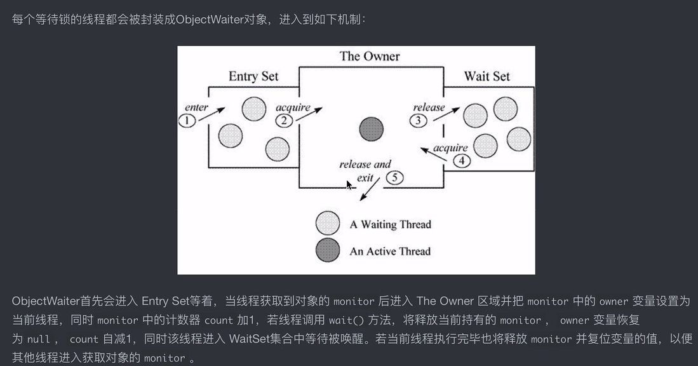
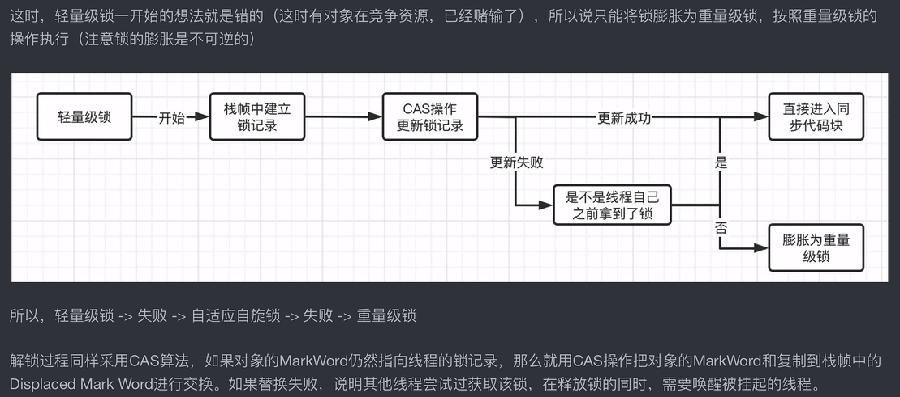
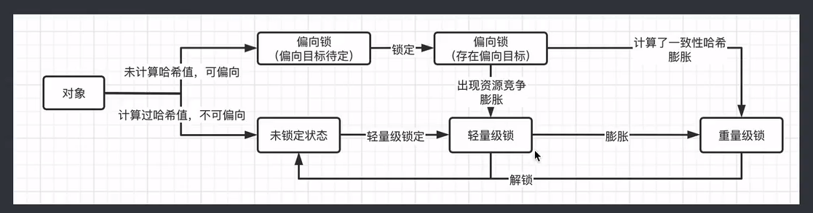
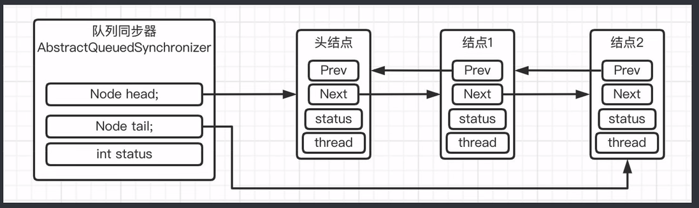
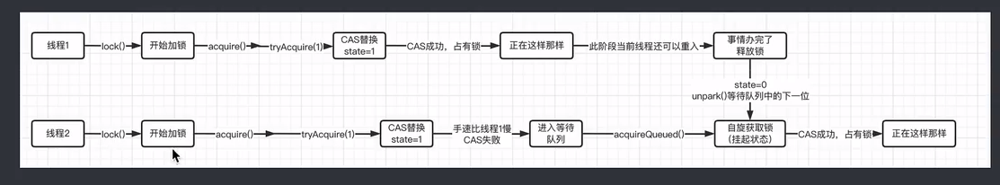
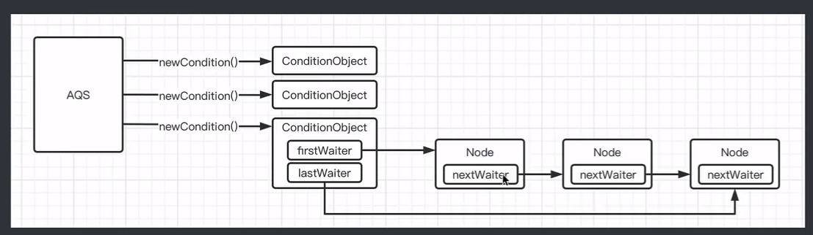
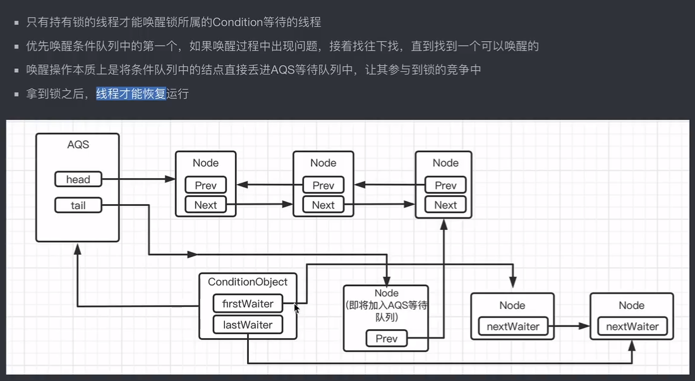
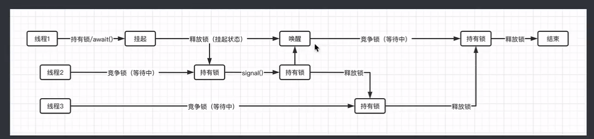
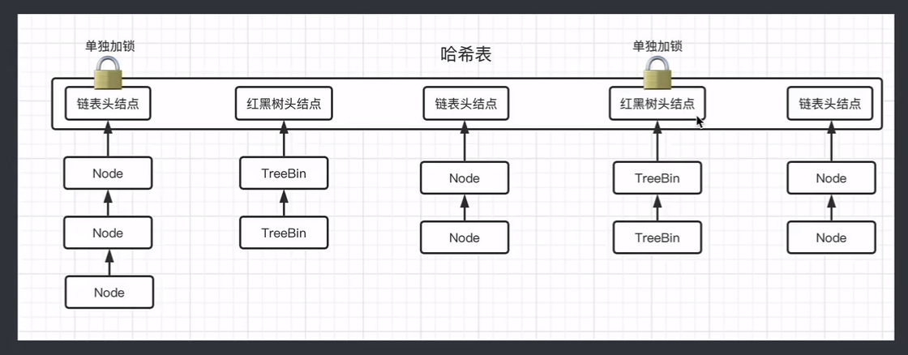
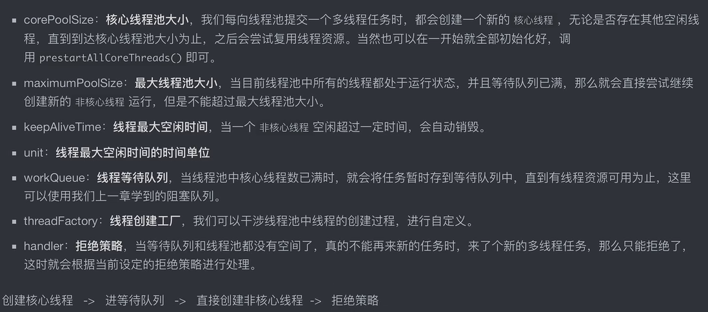

# Java基础

Sylvie233的Java基础学习~~~

> Author: Sylvie233
>
> Date: 2022/10/21
>
> Point: 
>
> ​	JUC教程P34

[TOC]

## 基础介绍

### java

```
java:
	
```


### javac

```
javac:
	
```


## 核心内容

### JVM


### NIO

Selector、Channel、Buffer


### JUC

重量级锁




自旋锁


轻量级锁

乐观锁CAS




偏向锁




JMM

java内存模型：Save、Load

指令重排序

volatile关键字：线程工作内存、主内存（还可以禁止指令重排）

内存栅栏

happens-before先行发生原则


Lock、Condition

#### 可重入锁

公平锁、非公平锁

#### 读写锁


#### 队列同步器AQS

锁机制底层

双向链表



CAS算法、Unsafe操作




#### Condition

条件队列








#### 原子类

CAS算法

Atomic

ABA问题：带版本号的原子类解决（默认CAS自旋仅进行值比较）


#### 并发容器

##### CopyOnWriteArrayList

可重入锁


##### ConcurrrentHashMap



红黑树


##### BlockingQueue

阻塞队列


#### 线程池

##### ThreadPoolExecutor

拒绝策略

线程创建工程




#### CountDownLatch


#### CyclicBarrier


#### Semaphore


#### Exchanger


#### Fork/Join


## API

```
java:
	io:
		Serializable:
	lang:
		reflect:
			Field:
		Class:
			forName():
			getDeclaredConstructor():
			newInstance():
		Object:
        System:
            err:
            in:
            out:
            currentTimeMillis():
        Thread:
            currentThread():
	nio:
	text:
		SimpleDateFormat:
			format():
	util:
		concurrent: 并发
			atomic:
				AtomicInteger:
					compareAndSet():
					getAndAdd():
					getAndIncrement():
				AtomicBoolean:
				AtomicIntegerArray:
				AtomicIntegerFieldUPdater: 字段原子更新器
					newUpdater():
					---
					incrementAndGet():
				AtomicLong:
				AtomicReference: 引用原子
					compareAndSet():
					get():
				AtomicStampedReference: 带版本号
				LongAdder:
					add():
			locks:
				AbstractQueuedSynchronizer: AQS队列
                Condition:
                	await():
                	signal():
                Lock:
                	newCondition():
                LockSupport:
                	park(): 线程挂起
                	unpark():
                ReadWriteLock:
                	readLock():
                	writeLock():
                ReentranLock:
                	getHoldCount():
                	getQueueLength():
                	hasQueuedThread():
                	isLocked():
                ReentranReadWriteLock:
            ArrayBlockingQueue: 有界带缓冲队列
            BlockingQueue:
            	put():
            	take():
            ConcurrentHashMap:
            CopyOnWriteArrayList:
            Delayd:
            DelayQueue:
            Executors:
            	newFixedThreadPool():
            	newSingleThreadExecutor():
            ExecutorService:
            	shutdown():
            	submit():
           	Future:
           		cancel():
           		get():
           		isCancelled():
           		isDone():
           	FutureTask:
           		get():
           		
            LinkedTransferQueue: 无界带缓冲阻塞队列
            PriorityBlockingQueue:
            ScheduledFuture:
            	
            ScheduledThreadPoolExecutor:
            	schedule():
            	scheduleAtFixedRate():	
            	scheduleWithFiexedDelay():
            SynchronousQueue: 无缓冲阻塞队列
            ThreadFactory:
            ThreadPoolExecutor: 线程池
            	execute():
            	getPoolSize():
            	shutdown():
            	shutdownNow():
            TimeUnit:
            	SECONDS: 秒
            		sleep():
            		timeWait():
            	convert():
		ArrayList:
		HashMap:
		HashSet:
			remove():
		List:
			size():
		Map:
			put():
			size():
		PriorityQueue:
	

sum:
	misc:
		Unsafe:
			allocateInstance():
			getUnsafe():
```


### java.io

#### FileInputStream


### java.nio

#### channels

##### FileChannel

```
FileChannel:
	read():
```


#### ByteBuffer

```
ByteBuffer:
	allocate():
	---
	clear():
	compact():
	flip(): 切换读写模式
	get():
	hasRemaining():
```

