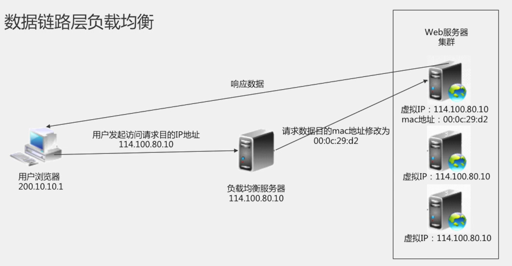
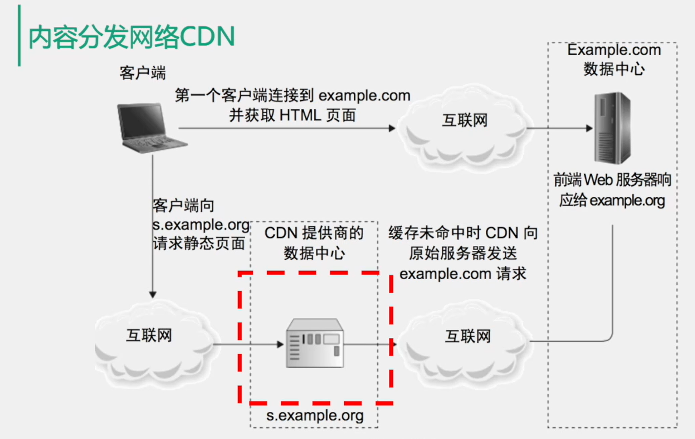
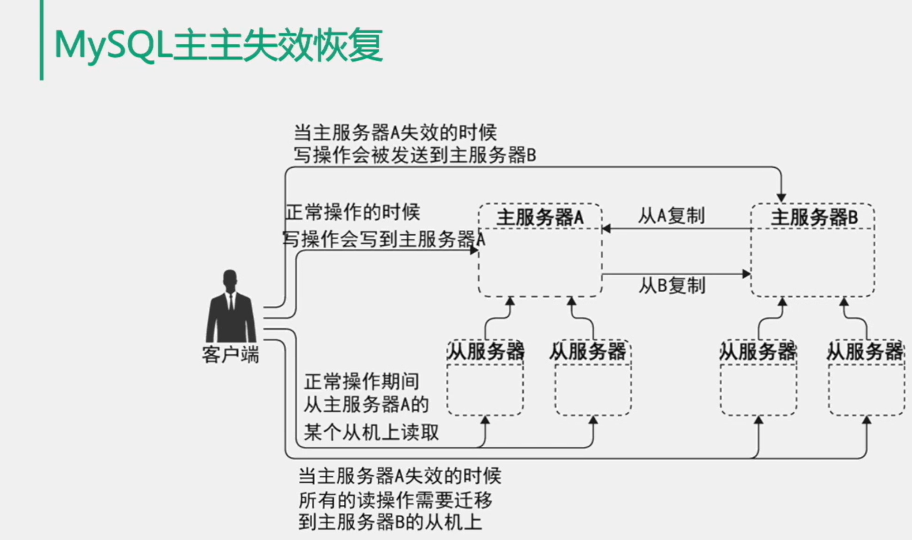

# 分布式架构理论

> Author: Sylvie233
>
> Date: 2023/5/8
>
> Point: 

[TOC]

## 基础介绍

大型架构系统演变

单机系统

数据库与应用分离

使用缓存改善性能

应用服务集群化

数据库读写分离

使用反向代理和CDN加速响应

使用分布式文件系统和分布式数据库

使用消息队列和分布式服务

高性能系统

### 系统性能测试

#### 响应时间

#### 并发数

#### 吞吐量

- 性能测试
- 负载测试
- 压力测试
- 稳定性测试

#### 系统性能优化	

异地多活的多机房架构；专线网络的自主CDN建设

操作系统优化

虚拟机性能优化

基础组件性能优化

软件架构优化：缓存、异步、集群

软件代码优化：设计模式、并发编程、资源复用、异步编程、数据结构

### 高可用

可用性度量

#### 负载均衡

#### 数据库转移

#### 消息队列隔离

#### 限流降级

#### 异地多活

#### 自动化测试

#### 自动化监控

#### 预发布 	

#### 灰度发布

### 系统安全

### CAP原理

数据一致性、最终一致性

一致性冲突的解决方案

### SOA架构

## 核心内容

### 分布式缓存

缓存命中率

**缓存读取：**

通读缓存

旁路缓存

**缓存类型：**

代理缓存

反向代理缓存

多层反向代理缓存

内容分发网络CDN

静态资源加速提供

**分布式对象缓存**

分布式对象缓存访问模型：

一致性hash算法：方便动态扩容时使用

虚拟节点实现负载均衡

**缓存问题：**

1. 频繁修改德数据
2. 没有热点德访问
3. 数据不一致与脏读
4. 缓存雪崩

### 分布式消息队列

消息队列模型

1. 点对点模型
2. 发布订阅模型

点对点模型：使用一个消息队列

发布订阅模型：使用多个消息队列，利用路由算法路由到不同的消息队列

消息队列好处：

- 一步处理
- 易伸缩
- 使峰值变平缓
- 隔离失效机器及自我修复
- 解耦

消息队列问题：

- 消息无序
- 消息重入队列
- 竞态条件
- 复杂度风险

消息队列反模式：

- 阻塞式调用
- 耦合消息生产者和消费者
- 缺少坏消息处理

服务解耦

### 分布式数据存储

MySQL主从复制

MySQL主主复制

#### 数据分片

#### 分布式数据库中间件

##### MyCat

#### 数据库部署方案

### 微服务

#### Dubbo

#### SpringCloud

#### 事件溯源

#### 命令与查询职责隔离(CQRS)

#### 断路器

#### 超时

